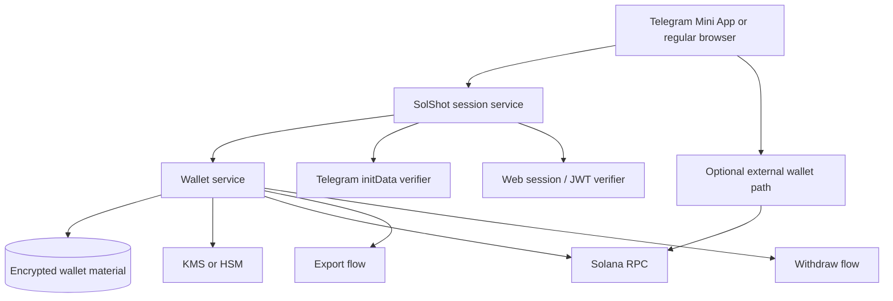
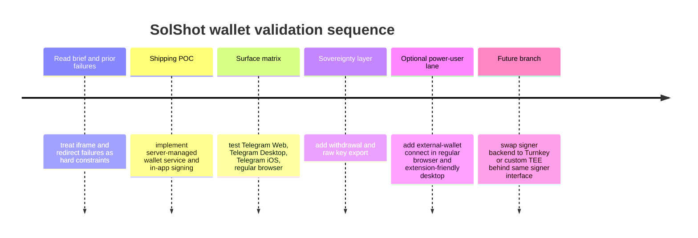

# Canonical Wallet Architecture for SolShot on Telegram Mini Apps

## Executive summary

I read the brief and treated your prior failures as evidence, not anecdotes. The brief establishes three hard facts: nested third-party wallet iframes have already failed in Telegram Web for your app, external-wallet flows break the “silent wallet” goal and are especially bad on Telegram iOS, and simple server-managed wallets already work everywhere for Telegram-native trading bots. fileciteturn0file1

My conclusion is deliberately blunt: **there is not yet a single off-the-shelf, evidence-backed Solana embedded-wallet vendor that I can responsibly call the canonical answer for Telegram Web + Telegram Desktop + Telegram iOS + a normal browser**. What *is* canonical today is an **architecture class**: **iframe-free signing with first-party or Telegram-native state**, not WalletConnect, not nested third-party auth iframes, and not flows that require jumping out to a portrait-only mobile wallet. Telegram Mini Apps now support fullscreen landscape, orientation locking, CloudStorage, and — since Bot API 9.0 — device-local `DeviceStorage` and `SecureStorage`, which strengthens the case for first-party/TG-native storage rather than cross-origin iframe state. citeturn33search0turn33search1turn30view0turn30view1turn31search3turn31search8

For **shipping SolShot**, the most defensible recommendation is:

**Recommended shipping architecture:**  
**App-owned server-managed Solana wallet service with first-class export/withdrawal, plus optional external-wallet connect for power users in regular browsers and desktop Telegram.**

That recommendation is not the prettiest from a purity standpoint, but it is the best fit for your actual constraints:

- it avoids iframe/CSP/cookie/storage failures entirely;
- it avoids non-http deep-link problems inside Telegram Web Apps;
- it avoids Telegram iOS context-switch/orientation problems;
- it meets the “silent wallet” requirement for free players and casual wagerers;
- it does not depend on a single wallet SaaS vendor staying up or granting production access. citeturn32search17turn33search0turn33search1

If you want the strongest *non-custodial-ish* alternative, the only candidate that came close to the bar is **Turnkey-style TEE remote signing with Telegram-native credential storage**. Turnkey has all three things the other vendors mostly lack together: official Solana support, official key export support, and an official Telegram Mini App demo bot and repo that explicitly use `TelegramCloudStorageStamper` plus Telegram CloudStorage to store API-key authenticators for client-side stamping. That is the single strongest public artifact I found for a Telegram-native wallet architecture outside the TON-only ecosystem. But it is still **vendor-dependent**, and I could not complete an authenticated Telegram Web transaction from this environment, so I still classify it as **promising, not yet canonical**. citeturn1search1turn2view0turn5view0turn1search1turn6search2turn8search0turn7search0

The biggest strategic risk is therefore not technical ambiguity anymore; it is **which compromise you want to own**:

- **Own custody/compliance yourself** and get the highest certainty of cross-surface functionality now.
- Or **accept vendor dependency** to improve the self-custody story, with Turnkey as the only serious near-term candidate worth hands-on validation on your exact device matrix. citeturn7search0turn8search0

## Verdict on the central question

**Verdict:**  
**No, there is not a proven off-the-shelf vendor today that I can confidently certify as the canonical Solana wallet solution across Telegram Web, Telegram Desktop, Telegram iOS, and a normal browser.**  
**Yes, there is a canonical architecture pattern that works: iframe-free signing plus first-party or Telegram-native state, with export/withdrawal as the user-sovereignty escape hatch.** fileciteturn0file1

Why I land there:

Telegram Mini Apps are still fundamentally web apps running inside Telegram-controlled containers. Telegram’s own docs now expose native-ish storage APIs — CloudStorage, DeviceStorage, and SecureStorage — which strongly suggests the safest path is to keep state in Telegram or your own first-party domain, not in a third-party iframe origin. Telegram also explicitly supports landscape/fullscreen Mini Apps and orientation locking, which solves the *game* orientation problem in-app but does **not** solve the *wallet redirect* problem if you still leave Telegram for signing. citeturn30view0turn30view1turn31search3turn31search8turn33search0turn33search1

The external-wallet path remains structurally fragile in Telegram because non-HTTP URL schemes in WebApps have long been problematic, and official Phantom guidance to Telegram builders has historically pointed them toward deeplinks. That is the opposite of a silent, all-surface, in-place signing model. citeturn32search17turn26search0

This is why the field splits cleanly into two serious options:

1. **You own the signer**  
   Server-managed wallet or your own TEE/KMS-backed signer. Highest certainty, lowest product risk, weakest purity story.

2. **You outsource the signer, but not the browser state model**  
   Turnkey is the clearest example: TEE-backed remote signing, Telegram-native storage helper, official Telegram demo artifacts, Solana export, and published pricing. Stronger self-custody story, but still a SaaS dependency. citeturn1search1turn2view0turn5view0turn6search2turn7search0turn8search0

The architectures I would **not** call canonical for SolShot are the same ones that depend on nested third-party iframe security contexts, cross-origin credentialed storage, or external wallet redirects. Your brief’s failure analysis lines up with Privy’s own iframe architecture and with Telegram’s deeplink/browser restrictions. fileciteturn0file1 citeturn27search0turn27search4turn27search2turn32search17

## Vendor matrix and architecture comparison

I could verify public docs, public repos, public bot endpoints, and architecture descriptions. I could **not** complete authenticated Telegram Web signing sessions from this environment, so “verified” below means **public TG artifact + architecture fit**, not a personally completed transaction inside a logged-in Telegram account.

### Vendor and pattern matrix

| Vendor / pattern | Solana support | TG-specific public evidence | Self-custody / export story | Pricing signal | Verdict |
|---|---|---|---|---|---|
| **Turnkey** | Yes. Solana accounts, Solana signer, Solana transaction tooling, Solana export/import formats are documented. citeturn1search1turn6search1 | Strongest TG evidence found: official `TurnkeyDemoBot`, official repo `tkhq/demo-telegram-mini-app`, and explicit use of `TelegramCloudStorageStamper` + Telegram CloudStorage for API-key authenticators. citeturn2view0turn5view0turn34view0 | Strong. Turnkey documents raw private-key and wallet export, including Base58 for Solana, with enclave-secure flows. citeturn6search2turn6search1 | Public and usable: free tier, then $0.10/signature PAYG, $99/mo Pro at $0.05/signature. citeturn8search0 | **Best non-custodial-ish candidate worth real device testing. Not yet canonical because vendor-dependent and I could not complete a live TG Web sign myself here.** |
| **MetaMask Embedded Wallets / Web3Auth** | Yes. Official Solana support, ed25519 keys, private-key access/export, React hooks, MPC docs. citeturn11search7turn11search3turn11search0turn10search4turn9search2 | Weak for Solana TG proof. I found official Telegram Mini App marketing/blog content, but it was TON-focused, not a Solana TG Web proof with code and live bot. citeturn13search0 | Strong on paper: 2-of-3 share model, device share + provider share + recovery share, export supported. citeturn9search2turn11search0 | Attractive: Growth starts at $69/month with 3,000 MAWs free. citeturn12search0 | **Promising but unproven for your exact TG/Solana problem.** |
| **Coinbase CDP Embedded Wallets** | Yes. Official Solana signing, transaction hooks, fee sponsorship, Wallet Standard integration, custom JWT auth. citeturn14search2turn14search4turn14search8turn15search9turn14search14 | Better than expected: official Telegram OAuth config exists for web apps, but I found no official Telegram Mini App demo proving Solana embedded signing inside TG Web. citeturn15search15turn17search13 | Strong on paper: Coinbase calls it user-custodied, supports key export, and documents secure export UI. citeturn14search0turn15search1turn15search8 | Good pricing for experimentation: 5,000 wallet operations free, then pay-as-you-go. citeturn12search20turn14search16 | **High-potential contender, but still unproven in TG Web Mini App reality.** |
| **Phantom Embedded / Phantom Connect** | Yes. Official embedded wallet support and Solana starter templates exist. citeturn24search1turn24search4turn24search5 | Mixed signals. Phantom now has embedded-wallet SDKs, but official Telegram guidance I found still pointed builders to deeplinks, and docs note iframe reconnect caveats. citeturn26search0turn24search10 | User-control story is strong in branding, but I did not find equally explicit raw-key export documentation for embedded Solana wallets comparable to Turnkey/CDP/Web3Auth. citeturn24search5turn24search8 | Very attractive: Phantom says Phantom Connect is free to developers. citeturn24search13 | **Interesting future option, but I would not bet SolShot on it yet.** |
| **Crossmint** | Yes. Official wallet docs support Solana; architecture is smart-wallet centric. citeturn18search3turn18search15turn18search17 | Official Telegram bot + repo exist, but the public Telegram demo I found is an EVM/Base shopping bot, not a Solana wagering game. citeturn20search0turn20search1 | Good on paper: export exists for email/phone signers; docs explicitly describe secure iframe/WebView export and TEE process. citeturn19search0 | Wallet pricing is public: 1,000 MAWs free, overages from $0.05/MAU; some advanced features are extra. citeturn36search0 | **Promising, but public Telegram proof is the wrong chain and wrong flow for your use case.** |
| **Magic** | Yes. Official Solana integration, Telegram social login, and key export are documented. citeturn21search1turn23search1turn22search2turn23search0 | No convincing TG Web proof found. Telegram login exists, but export/reveal is iframe-based and I found no public Solana TG Mini App reference app. citeturn23search1turn23search0 | Good on paper: TEE-based wallet infra, key export supported. citeturn21search0turn22search2turn22search0 | Public pricing: first 1,000 MAUs free; MAW pricing starts from $0.035. citeturn36search1turn36search7 | **Unproven and still too iframe-adjacent for comfort.** |
| **Privy** | Yes. Solana embedded wallets and Base58 export are documented. citeturn27search7turn27search1 | Poor fit. Privy explicitly documents an iframe secure context for embedded wallets and on-device execution. That is the same failure class your brief already ruled out. citeturn27search0turn27search4turn27search2 | Export exists, but the architecture still relies on the secure iframe. citeturn27search1turn27search5 | Brief says pricing became materially expensive for your use case after acquisition. fileciteturn0file1 | **Rejected for SolShot. Architectural mismatch, not just implementation risk.** |
| **Dynamic / Fireblocks** | Solana yes in general; TON Telegram support launched recently. citeturn28search4turn28search5turn28search0 | Your brief documents TG Web failure on Solana due to iframe/CSP behavior; recent official Telegram/TON launch does not prove the Solana case is fixed. fileciteturn0file1 citeturn28search0turn28search5 | Non-custodial embedded-wallet story exists, but the implementation class already failed for you. fileciteturn0file1 | Enterprise / talk-to-sales. citeturn36search2turn36search5 | **Rejected for SolShot as currently scoped.** |
| **Custodial roll-your-own** | Yes. Native Solana keypair handling is trivial from an architecture perspective. | This is the one architecture class already established in Telegram-native bot products and does not depend on browser storage quirks. Your brief cites Banana Gun / Trojan / Maestro as production proof of the pattern. fileciteturn0file1 | Can be made acceptable with raw Base58 export + withdraw-to-any-address. | Infra-driven, not MAU-taxed. | **Recommended for shipping certainty.** |
| **Roll-your-own MPC with Telegram storage** | Yes in principle. | Telegram now offers CloudStorage, DeviceStorage, and SecureStorage, which makes the pattern more plausible than it was a year ago. But I found no audited, public Solana Telegram Mini App reference implementation proving the whole thing. citeturn30view0turn30view1turn31search3turn31search8 | Potentially excellent if done well. | Vendor-light, engineering-heavy. | **Strategic R&D path, not the fastest path to production.** |

### Architecture comparison table

| Architecture | Security | UX | TG Web compatibility | TG iOS behavior | Custody model | Developer effort | Cost profile | My assessment |
|---|---|---|---|---|---|---|---|---|
| **App-owned server-managed signer + export/withdraw** | Strong if KMS/HSM-backed, weakest on legal/custody optics | Best | Best | Best | Custodial with escape hatch | Medium | Low-to-moderate infra | **Best shipping path** |
| **Turnkey-style TEE remote signer + Telegram-native state** | Strong technical security, vendor dependency remains | Excellent | Likely strong | Likely strong | Non-custodial-ish / user-authorized | Medium | Signature-based vendor cost | **Best high-upside alternative** |
| **Custom MPC + Telegram storage** | Strongest long-term if audited | Excellent | Potentially best | Potentially best | True threshold model | Very high | Audit-heavy | **Long-term ideal, short-term risky** |
| **MetaMask/CDP/Crossmint/Magic class** | Usually strong on paper | Usually strong | Unknown for your exact case | Unknown / mixed | Usually self-custodial | Low-to-medium | MAU-based or mixed | **Do not choose without your own TG Web proof** |
| **External wallet only** | Strong self-custody | Worst for mainstream users | Acceptable only when extension/app exists | Weak | Self-custodial | Low | Low | **Keep as optional power-user path only** |

## Recommended architecture deep dive

### Recommendation

**Ship a hybrid architecture whose default signer is your own server-managed wallet service, while exposing optional bring-your-own-wallet support on regular browser and extension-friendly desktop contexts.**

That gives you one product that works everywhere, one silent onboarding path, and one abstraction layer you can later swap to a Turnkey-style TEE backend without rewriting the frontend wallet UX. The frontend should never care whether the signer is:

- your KMS-backed service,
- a Turnkey backend,
- or an external Wallet Standard / wallet-adapter connection.

It should only ask for `signMessage`, `signTransaction`, `sendTransaction`, `exportKey`, and `withdraw`. That seam is what keeps you from painting yourself into a corner.

### Why this architecture avoids your known failure modes

It does **not** require any nested third-party iframe for wallet creation or transaction signing. It does **not** require third-party cookies. It does **not** depend on custom URL schemes or app-switching to an external wallet. That directly avoids the failure classes already described in your brief and aligns with Telegram’s own WebApp behavior, where non-HTTP URL protocols are unreliable and first-party/TG-native storage is the safer primitive. fileciteturn0file1 citeturn32search17turn30view0turn30view1turn31search3

### Recommended system shape

### Practical integration shape

On first open, you already know the Telegram user from `initData` in the Mini App and your own auth/session in the regular browser. Use that identity to create or look up an internal SolShot user record. Free players never see wallet UI. Wagerers hit one explicit “enable wagering” step that provisions a server-side Solana wallet and credits the UI with an embedded account. On regular desktop browser, you may also show “Use external wallet instead” for Phantom/Solflare/Backpack users. That keeps mainstream onboarding silent while preserving a native self-custody path for power users. Telegram itself provides the user-bound authorization substrate and native storage APIs you can use for auxiliary state, but the signing action lives in your backend and therefore remains surface-agnostic. citeturn30view0turn30view1turn31search3turn31search8

### Security model

Use one wallet per user. Generate the wallet server-side. Encrypt at rest with envelope encryption via KMS/HSM. Maintain a narrow signing service that accepts only validated transaction intents from your application layer. Enforce:

- server-side program allowlists for SolShot program IDs,
- amount/risk limits,
- replay protection and idempotency keys,
- export cooldowns,
- withdrawal cooldowns for newly created or newly funded wallets,
- audit logging on every signature request.

This is the part hackathon judges will scrutinize. The defensible answer is not “trust us”, it is “we chose the only architecture that survives every Telegram surface today, and we paired it with immediate withdrawal, explicit key export, and policy-constrained signing.”

### Self-custody escape hatch

For a wagering game, “self-custody story” does not need to mean “every first wager is signed by Phantom.” It needs to mean **users are never trapped**.

My recommendation is:

- **In-app withdrawal to any address** at all times.
- **Raw private-key export** as a deliberate flow with step-up auth and warnings.
- Preferably surface export on the normal browser app first, because that is the least awkward context for a sensitive operation.

That is a stronger product decision than forcing Phantom into Telegram iOS and breaking the game loop.

### Live-test artifacts that actually matter

The single strongest public Telegram-wallet artifact I found is Turnkey’s official Telegram demo stack:

- the official bot `TurnkeyDemoBot`;  
- the public repo `tkhq/demo-telegram-mini-app`;  
- and the documented use of `TelegramCloudStorageStamper` plus Telegram CloudStorage to store API-key authenticators for client-side stamping. citeturn34view0turn2view0turn5view0

The strongest *counterexample* artifact is your own brief, which documents that Dynamic/Para/Privy-style embedded-wallet classes failed specifically because Telegram Web made the third-party iframe/storage model brittle. Privy’s own docs confirm that its secure context is iframe-based. fileciteturn0file1 citeturn27search0turn27search4

The strongest “interesting but not enough” artifacts are:

- Crossmint’s official Telegram shopping bot and repo — but they are EVM/Base examples, not Solana wager-flow proof. citeturn20search0turn20search1
- Coinbase’s official CDP demo-app repo and Solana embedded-wallet docs — strong product surface, but no public Telegram Mini App proof. citeturn17search13turn14search6turn14search2
- Phantom’s official Solana embedded templates — promising, but not Telegram-proofed. citeturn24search4turn25search0

### Timeline for validation

## Architectural rejection notes

**External wallet only** is rejected as the default because it fails your product requirement, not because wallet-adapter is bad. Telegram Mini Apps are now strong enough for fullscreen landscape gameplay, but the moment you rely on external signing you reintroduce deep-linking, app-switching, and orientation/context problems that Telegram itself does not solve for you. citeturn33search0turn33search1turn32search17turn26search0

**Privy / Dynamic / same-class iframe architectures** are rejected because the architecture class is already contradicted by both your brief and Privy’s own docs. Privy explicitly documents an iframe secure context. Dynamic’s recent Telegram/TON push is real, but that does not retroactively prove the Solana-in-Telegram-Web case you already broke in production. fileciteturn0file1 citeturn27search0turn27search4turn28search0turn28search5

**MetaMask Embedded / Web3Auth** is not rejected because it looks bad; it is rejected because the public proof is insufficient. The architecture is materially better than Dynamic/Privy for your use case because the device share lives in browser/device context and the model is threshold-based. But the Telegram evidence I found was TON-centered marketing, not a Solana TG Web proof with public bot, code, and verified signing path. citeturn10search4turn9search2turn13search0

**Coinbase CDP Embedded** is in the same bucket: impressive product surface, clean Solana support, custom JWT auth, and explicit Telegram OAuth config for web apps — but still not enough Telegram Mini App proof for a wager-flow recommendation. If you later prove it on your own matrix, it could become a serious replacement for the custodial path. citeturn14search2turn15search9turn15search15turn14search16

**Crossmint** is strategically interesting because its wallet architecture is more portable than many competitors and it has a real Telegram bot demo. But the public Telegram bot I found is EVM commerce, not Solana gaming, and the export flow still relies on a secure iframe/WebView. That is not enough for canonical status in your exact problem. citeturn20search0turn20search1turn19search0turn18search15

**Magic** is rejected for now because the ingredients are there — Solana, Telegram login, TEE, key export — but the public proof is still missing, and key export is iframe-driven. That is too much “should work” energy for a founder who has already lost a day to exactly that kind of answer. citeturn21search1turn23search1turn23search0turn22search2

**Roll-your-own MPC now** is rejected as the immediate plan not because it is wrong, but because it is a trap. Telegram’s storage surface is much better in 2026 than many people realize — especially with `SecureStorage` and `DeviceStorage` added in Bot API 9.0 — so a first-party threshold design is more plausible than it was in early 2025. But for a consumer wager product, the audit and recovery burden is too high to call it the near-term canonical choice. citeturn31search3turn30view1turn31search8

## Implementation cost and hackathon framing

### Estimated implementation cost

These are my rough engineering estimates, not vendor quotes.

| Path | Time to first devnet wagered match | Hardening before serious beta | Ongoing run cost |
|---|---|---|---|
| **Recommended: app-owned server-managed signer** | **5–10 engineering days** | **1–2 additional weeks** for export, withdrawal, limits, logging, abuse controls | Low cloud/KMS cost; no MAU tax |
| **Turnkey branch** | **3–7 engineering days** if the TG path works on your matrix | **1–2 weeks** of device-matrix testing and export-path validation | Turnkey pricing starts free, then signature-based. citeturn8search0 |
| **CDP / MetaMask / Crossmint branch** | **4–8 engineering days** for a basic prototype | Could balloon if Telegram-specific issues appear | Public starter pricing exists, but proof risk is the real cost. citeturn12search0turn14search16turn36search0 |
| **Custom MPC** | **3–6 weeks minimum** | **Audit-heavy** | Lowest vendor dependency, highest engineering cost |

### Hackathon framing

If you ship the recommended architecture, the right framing is:

> **“We optimized for Telegram-native product reality first. Wallet onboarding is invisible, signing never leaves the Mini App, and users retain sovereignty via immediate withdrawal and first-class key export. The wallet boundary is abstracted so we can swap the signer backend to TEE-based or threshold-based infrastructure without changing the UX.”**

That is actually more credible than pretending an unproven embedded-wallet vendor is battle-tested on every Telegram surface.

If you decide to run a parallel **Turnkey POC** and it passes your device matrix before demo day, the best hackathon framing becomes:

> **“We use TEE-isolated signing with Telegram-native credential storage, avoiding the iframe/cookie failures that break other embedded-wallet stacks on Telegram Web.”** citeturn2view0turn5view0turn7search0

My ranking for judge appeal is:

1. **Turnkey-style TEE signer that you have personally proven on your device matrix.**
2. **App-owned signer with instant withdraw/export and a clean migration seam.**
3. **Vendor MPC (MetaMask/CDP/Crossmint) only if you prove it yourself first.**
4. **External-wallet-only**, which is pure but not matched to Telegram consumer-game UX.

## Open questions and limitations

The biggest limitation of this report is specific and important: **I could verify public artifacts, repos, docs, pricing pages, and Telegram/WebApp primitives, but I could not authenticate into Telegram Web from this environment to complete live end-to-end signing sessions.** That means I am comfortable calling several candidates *promising* and one path *ship-safe*, but I am **not** comfortable claiming a fully verified winner among the embedded-wallet vendors.

The practical open questions for you are therefore:

- **Do you require raw private-key export to work inside Telegram Web itself, or is export on the normal browser app acceptable?**  
  That answer changes how attractive Turnkey/CDP/Crossmint become, because several export flows use secure iframes/WebViews. citeturn6search4turn15search1turn19search0

- **How much custody/compliance risk are you willing to own during hackathon and early beta?**  
  If the answer is “very little,” run the Turnkey validation branch sooner.

- **Do you want one wallet identity across all surfaces or only one account identity across all surfaces?**  
  That matters because Telegram’s new `DeviceStorage` and `SecureStorage` make multi-device share management more realistic, but still not free. citeturn30view1turn31search8

- **Are you willing to make external wallets an optional “advanced mode” instead of the default?**  
  I think you should.

The shortest honest summary is this: **for SolShot, the least-bad canonical architecture today is not an off-the-shelf wallet SDK; it is an iframe-free signer architecture. Ship that. Keep Turnkey as the only serious non-custodial-ish branch worth immediate live testing.**