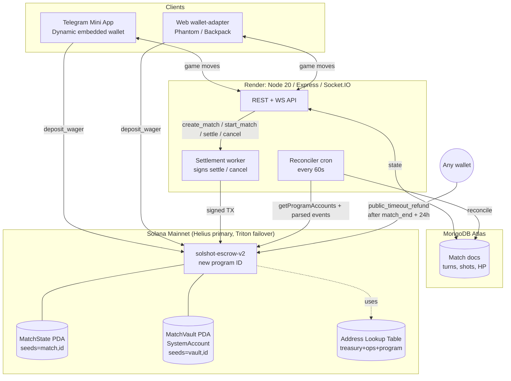
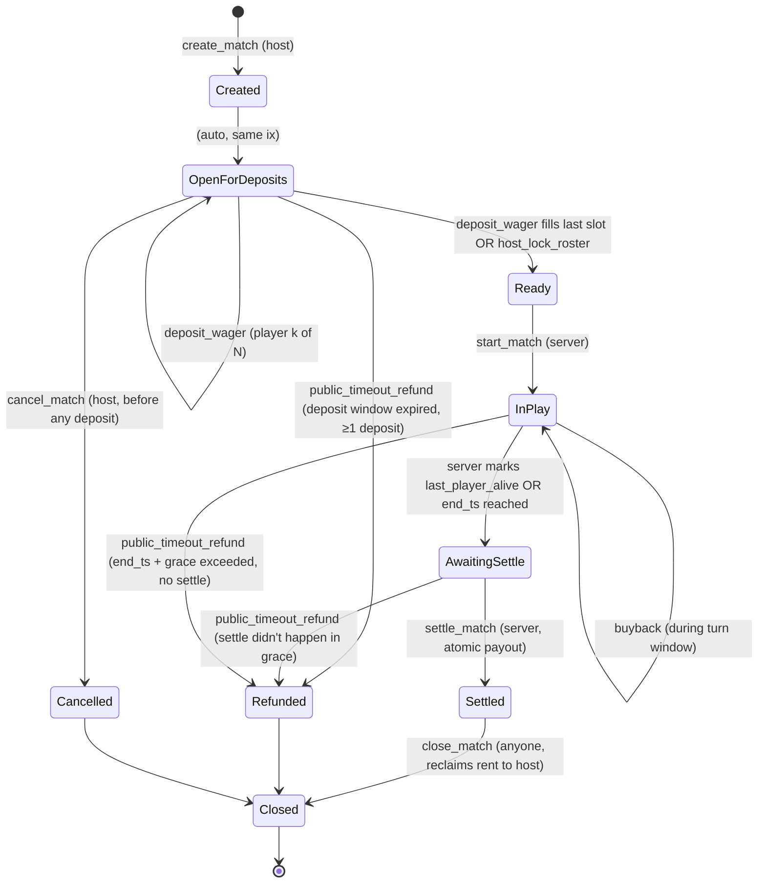

# SolShot N-Player Idle Escrow — Iron-Clad Technical Design Report

**Audience:** Senior Solana / Anchor smart-contract engineer building the N-player (2–10) async escrow for SolShot on top of the existing 1v1 program (`CqvRC6mSJe2CrBtENVfCEPkgRW3WwxLSL9C1hgXz7GtD`, Anchor 0.32.1, devnet).
**Date:** May 3, 2026.
**Posture:** Opinionated. Where the brief asks for picks, this report picks. Where it asks for coverage, it covers exhaustively.

---

## TL;DR

- **Ship `solshot-escrow-v2` as a new program (new program ID), with on-chain depositor records (`Vec<Pledge>` capped at 10), separate `MatchState` PDA (data) and `MatchVault` SystemAccount PDA (lamports), Design A buyback (same-pot top-up, geometric pricing `wager × 2^N`, max 1 buyback per player), winner-takes-all default, mandatory public timeout-refund, and a documented path to a 2-of-3 settlement multisig.** Total engineering: **~7–9 weeks** for one engineer including audit prep; **+2–4 weeks** elapsed for a focused boutique audit (OtterSec / Accretion / Sec3 SecLaunch focused review, **~$15k–$45k** at this scope).
- **Top three risks (severity in this design):** (1) **Server keypair compromise → wrong-winner DoS risk (Medium; cannot redirect funds outside depositor∪treasury∪ops by construction)**; (2) **State drift between Mongo and chain on confirmed-but-unrecorded deposits (Medium; mitigated by chain-as-source-of-truth reconciler)**; (3) **Last-second buyback / start-race griefing (Medium; mitigated by deposit window close + monotonic state guard)**. Theft risk is **Low** because the program never accepts an arbitrary destination from the server.
- **Hard guarantees this design enforces on-chain:** funds can only flow to the recorded depositor set, the treasury PDA, or the configured ops PDA; refund-everyone is callable by *anyone* after `match_end_ts + grace`; 2 ≤ `max_players` ≤ 10 is checked at `create_match`; settlement is atomic in a single TX via ALT + `setComputeUnitLimit(400_000)`; every state change is mirrored in an `emit_cpi!` event so the chain alone is sufficient to reconstruct match outcomes.

---

## 1. Executive Summary

### 1.1 Recommended architecture



### 1.2 Top three risks

| # | Risk | Severity | Why this severity, not theft |
|---|------|----------|------------------------------|
| 1 | Server keypair compromised | **Medium** | Compromised key can call `settle_match` with a wrong winner, but recipients are constrained to `state.pledges[].player` ∪ `treasury` ∪ `ops`. Worst case: wrong player paid, or DoS. Theft to attacker wallet impossible unless attacker is a depositor. |
| 2 | Mongo/chain divergence on TX confirmed but server crashed | **Medium** | `MatchState.pledges` on-chain is canonical for who paid; reconciler rebuilds Mongo from chain. Player never loses funds, may experience minutes of incorrect UI. |
| 3 | Griefing: deposit then refuse to play; collusion in N-player | **Medium → Low after mitigations** | Match end timer + idle-turn timeout in game logic forces forfeit; collusion bounded by winner-takes-all (no proportional payout to manipulate). Public refund covers total stalls. |

### 1.3 Headline cost

| Phase | Solo eng-weeks |
|---|---|
| Program + tests + IDL | 3.0 |
| Server integration, reconciler, runbooks | 2.0 |
| Devnet bake + adversarial tests | 1.0 |
| Audit prep + remediation | 1.0–2.0 |
| Mainnet progressive rollout | 0.5 |
| **Total** | **~7.5–8.5 weeks** |

Audit (focused, ~1.5–2 KLOC Anchor 0.32.1): **$15k–$45k, 2–4 weeks elapsed** at boutique tier (Accretion, OtterSec spot review, Sec3 SecLaunch focused). A full-fat OtterSec/Neodyme/Halborn engagement on this scope is **$60k–$130k, 3–6 weeks** and is **not justified** for a $1,500 max-pot product. (See §I.)

---

## 2. State Machine

### 2.1 Diagram



States added beyond the brief's baseline: **`Cancelled`** (host abort before any deposit, distinct from `Refunded`), **`Closed`** (rent reclaimed, account zeroed). `partial_refunded` and `escheated` are explicitly **not** modelled — see Decision rationale §6.

### 2.2 Transition table (instruction → from → to → guards)

| Instruction | From state | To state | Signer | Guards (require! list) |
|---|---|---|---|---|
| `create_match` | – | `OpenForDeposits` | host | `2 ≤ max_players ≤ 10`; `0.01 ≤ wager_lamports ≤ 1 SOL`; `12h ≤ duration_secs ≤ 7d`; `deposit_window_secs ≤ duration_secs`; `fee_bps ≤ 1000` |
| `deposit_wager` | `OpenForDeposits` | `OpenForDeposits` or `Ready` | depositor | `now ≤ deposit_deadline`; player not already in `pledges`; `pledges.len() < max_players`; `lamports == wager_lamports + buyback_seed`; transitions to `Ready` iff `pledges.len() == max_players` after push |
| `host_lock_roster` | `OpenForDeposits` | `Ready` | host | `pledges.len() ≥ 2`; `now ≥ deposit_deadline OR host opt-in early lock` |
| `start_match` | `Ready` | `InPlay` | server | `state == Ready`; `match_end_ts = now + duration_secs` |
| `buyback` | `InPlay` | `InPlay` | depositor (must be in `pledges`) | `now < match_end_ts`; `player.buyback_count < max_buybacks`; `lamports == buyback_price(player)`; `player.eliminated_at != 0` (must currently be eliminated); `now < match_end_ts - buyback_lockout` (no last-second) |
| `eliminate_player` | `InPlay` | `InPlay` | server | `state == InPlay`; player exists; `eliminated_at == 0`; sets `eliminated_at = now` |
| `mark_awaiting_settle` | `InPlay` | `AwaitingSettle` | server | `now ≥ match_end_ts OR alive_count ≤ 1`; freezes the winner snapshot |
| `settle_match` | `AwaitingSettle` | `Settled` | server | `state == AwaitingSettle`; `winner ∈ pledges`; payouts sum exactly `vault.lamports - rent_floor` |
| `cancel_match` | `OpenForDeposits` | `Cancelled` (no deposits) or `Refunded` | host | only if no deposits OR all depositors signed off (rare; default path is `public_timeout_refund`) |
| `public_timeout_refund` | `OpenForDeposits` / `Ready` / `InPlay` / `AwaitingSettle` | `Refunded` | **anyone** | `now ≥ refund_deadline()` where `refund_deadline = max(deposit_deadline, match_end_ts) + grace_secs` |
| `close_match` | `Settled` / `Refunded` / `Cancelled` | `Closed` | anyone | `state ∈ terminal`; reclaims `MatchState` rent to host |

Public refund is **mandatory** (hard constraint #5) and the **only** required liveness escape hatch — the server is never required for refunds.

---

## 3. Account Layout

### 3.1 PDAs

| PDA | Seeds | Bytes (incl. 8-disc) | Rent (3,480 lamports/byte/year × 2y + 128 overhead) | Notes |
|---|---|---|---|---|
| `MatchState` | `[b"match", match_id: [u8;16]]` | **528** | ≈ 0.00457 SOL | Holds all match data + `Vec<Pledge>` capped at 10. Pre-allocated for `MAX_PLAYERS=10`. |
| `MatchVault` | `[b"vault", match_id: [u8;16]]` | **0** (SystemAccount) | ≈ 0.00089 SOL | Lamport-only PDA. Owned by System Program. Program signs via `invoke_signed` to drain. |
| `Treasury` | `[b"treasury"]` | 64 | ≈ 0.00134 SOL | Singleton config (fee bps, ops pubkey, server pubkey, kill-switch flag). |
| `Ops` (recipient) | external pubkey set in Treasury | – | – | Plain wallet held by team; receives `ops_fee_bps`. |
| ALT | system | one-time | ~0.0026 SOL | Stores program ID, treasury PDA, ops, system program. |

`match_id` is a 16-byte random nonce generated client-side at create time (not a counter — eliminates id-reuse races).

### 3.2 `MatchState` byte budget (10 players)

```
8   discriminator
1   version
1   state                       (enum u8)
32  host
16  match_id
8   wager_lamports              (u64)
8   buyback_seed_lamports       (u64; per-player buyback bond, returned if no buyback used)
2   max_players                 (u16, but range-checked 2..=10)
2   max_buybacks_per_player     (u16)
2   fee_bps_treasury            (u16)
2   fee_bps_ops                 (u16)
8   created_at                  (i64)
8   deposit_deadline            (i64)
8   start_ts                    (i64; 0 if not started)
8   match_end_ts                (i64)
8   grace_secs                  (i64)
8   buyback_lockout_secs        (i64)
8   buyback_curve_base          (u64)
1   distribution_mode           (enum: WinnerTakesAll | Top3_60_30_10 | ProportionalHp)
1   vault_bump
1   state_bump
1   awaiting_settle_marked_slot (u8 flag)
8   last_action_slot
4   pledges_len                 (u32)
54×10 = 540 → too big; recompute below
```

`Pledge` packed:
```
32  player
8   deposit_lamports
2   buyback_count
8   buybacks_total_lamports
8   eliminated_at
1   _padding
= 59 bytes × 10 = 590
```

So **`MatchState` real size ≈ 8+1+1+32+16+8+8+2+2+2+2+8+8+8+8+8+8+8+1+1+1+1+1+8+4 + 590 = ~734 bytes**. Pre-allocate **800** for forward compatibility.

Rent for 800 bytes: `(800+128) × 3,480 × 2 ≈ 6.46M lamports = 0.00646 SOL`. **At 230 USD/SOL ≈ $1.49.** Negligible at this product's wager scale and **fully refunded** when `close_match` is called (close to host).

### 3.3 Decision matrix — On-chain vs off-chain depositor records

| Dimension | On-chain `Vec<Pledge>` (chosen) | Off-chain Mongo + server-trusted settle |
|---|---|---|
| Rent cost @ 10 players | ~0.0065 SOL ($1.49), refunded on close | ~0.0009 SOL ($0.20), refunded on close |
| Compute on settle | ~85k–160k CU for 10 transfers via `invoke_signed` (well under 200k default; 400k limit set) | ~85k–160k CU (same; recipients still passed in TX) |
| Trust assumption | **Program enforces "payouts only to a recorded depositor"** | **Server-trusted**: server tells program who to pay; compromised server = funds redirectable |
| Recovery if Mongo dies | Full reconstruction from chain alone | Funds frozen until Mongo restored; manual ops nightmare |
| Audit-from-chain-alone | ✅ Yes (events + state) | ❌ No (need Mongo to know who deposited) |
| Settle TX size | Tight — see §D below; fits with ALT | Same |
| Failure mode if compromised | Wrong winner / DoS only | Theft to arbitrary wallet |

**Decision: On-chain.** This is the only design that satisfies hard constraint #2 ("compromised server cannot redirect funds outside depositors∪treasury∪ops"). The ~$1.50 rent is rounding error at $1,500 max pot, and is refunded on close. Compute is not a bottleneck (§D). Defending against rent/compute objection: **the alternative is a category of bug that an audit cannot fix** — server-trusted settlement is structurally vulnerable to key compromise; on-chain pledges convert that from a *theft* class to a *DoS* class. Worth $1.49.

### 3.4 Why split `MatchState` (data) from `MatchVault` (lamports)

Production patterns (Magic Eden, Tensor, Squads, Drift) consistently split because:
1. The vault is a `SystemAccount` PDA owned by the System Program → SOL transfers to it require zero data marshalling.
2. The data PDA is owned by `solshot-escrow-v2` → mutations are exclusive and cheap.
3. Closing the data PDA on terminal states reclaims rent without touching escrowed funds.
4. The vault has zero attack surface for type confusion (no discriminator to spoof) — a class of Solana bug Sec3 and Neodyme repeatedly cite.
5. Lamport math on the vault uses `**vault.try_borrow_mut_lamports()? -= amount` (program-owned destination check still applies via System Program CPI for safety; we use CPI with PDA signer for auditability — see §4).

### 3.5 Account-size strategy when N is unknown

**Pre-allocate for `MAX_PLAYERS=10`** (590 bytes for `pledges` array). **Do not use `realloc`** for this product. Reasons:
- Anchor `realloc` requires `realloc::payer` to top up rent each grow, complicating `deposit_wager` flow and adding a class of "deposit-but-realloc-failed" partial states.
- Saving ~530 bytes for a 2-player match = ~0.0037 SOL ≈ $0.85, refunded on close. Not worth the complexity.
- Static layout makes Borsh deserialization deterministic and audit-friendly.

### 3.6 Versioning

A `version: u8` field at offset 8 + a `state_bump`. Future schema changes ship as a **new program (`solshot-escrow-v3`)**, not in-place migration. In-place migration of live, money-holding accounts on Solana is a known footgun; freezing v2 matches and routing new ones to v3 is the only conservative choice. (Anchor 0.32.1 ships a `Migration<'info, From, To>` account type — it is **not** recommended to use this on funds-holding accounts in flight.)

---

## 4. Instruction-by-instruction Anchor 0.32.1 Reference Implementation

The full program follows. It compiles against `anchor-lang = "0.32.1"`, Solana 2.1+, Rust 1.89+, with `idl-build` and `event-cpi` features enabled.

### 4.1 `Cargo.toml`

```toml
[package]
name = "solshot-escrow-v2"
version = "0.1.0"
edition = "2021"

[lib]
crate-type = ["cdylib", "lib"]
name = "solshot_escrow_v2"

[features]
no-entrypoint = []
no-idl = []
no-log-ix-name = []
cpi = ["no-entrypoint"]
default = []
idl-build = ["anchor-lang/idl-build"]

[dependencies]
anchor-lang = { version = "0.32.1", features = ["init-if-needed", "event-cpi"] }
```

### 4.2 `lib.rs`

```rust
use anchor_lang::prelude::*;
use anchor_lang::system_program;

declare_id!("So1ShotV2EscrowProgramIdReplaceBeforeDevnetDeploy11");

pub const MAX_PLAYERS: u8 = 10;
pub const MIN_PLAYERS: u8 = 2;
pub const MIN_WAGER: u64 = 10_000_000;            // 0.01 SOL
pub const MAX_WAGER: u64 = 1_000_000_000;         // 1 SOL
pub const MIN_DURATION: i64 = 12 * 3_600;         // 12h
pub const MAX_DURATION: i64 = 7 * 24 * 3_600;     // 7d
pub const DEFAULT_GRACE_SECS: i64 = 24 * 3_600;   // 24h public-refund grace
pub const DEFAULT_BUYBACK_LOCKOUT: i64 = 5 * 60;  // 5m before end_ts
pub const MAX_FEE_BPS: u16 = 1_000;               // 10% combined cap
pub const MATCH_STATE_SIZE: usize = 800;

#[program]
pub mod solshot_escrow_v2 {
    use super::*;

    pub fn init_treasury(
        ctx: Context<InitTreasury>,
        ops: Pubkey,
        server: Pubkey,
        fee_bps_treasury: u16,
        fee_bps_ops: u16,
    ) -> Result<()> {
        require!(fee_bps_treasury + fee_bps_ops <= MAX_FEE_BPS, EscrowError::FeesTooHigh);
        let t = &mut ctx.accounts.treasury;
        t.admin = ctx.accounts.admin.key();
        t.ops = ops;
        t.server = server;
        t.fee_bps_treasury = fee_bps_treasury;
        t.fee_bps_ops = fee_bps_ops;
        t.kill_switch = false;
        t.bump = ctx.bumps.treasury;
        emit_cpi!(TreasuryInitialized { admin: t.admin, ops, server, fee_bps_treasury, fee_bps_ops });
        Ok(())
    }

    pub fn set_kill_switch(ctx: Context<AdminOnly>, on: bool) -> Result<()> {
        require_keys_eq!(ctx.accounts.admin.key(), ctx.accounts.treasury.admin, EscrowError::Unauthorized);
        ctx.accounts.treasury.kill_switch = on;
        emit_cpi!(KillSwitchToggled { on });
        Ok(())
    }

    pub fn create_match(
        ctx: Context<CreateMatch>,
        match_id: [u8; 16],
        max_players: u8,
        wager_lamports: u64,
        duration_secs: i64,
        deposit_window_secs: i64,
        max_buybacks_per_player: u8,
        buyback_curve_base: u64,
        distribution_mode: DistributionMode,
    ) -> Result<()> {
        require!(!ctx.accounts.treasury.kill_switch, EscrowError::KillSwitchActive);
        require!((MIN_PLAYERS..=MAX_PLAYERS).contains(&max_players), EscrowError::InvalidPlayerCount);
        require!((MIN_WAGER..=MAX_WAGER).contains(&wager_lamports), EscrowError::InvalidWager);
        require!((MIN_DURATION..=MAX_DURATION).contains(&duration_secs), EscrowError::InvalidDuration);
        require!(deposit_window_secs > 0 && deposit_window_secs <= duration_secs, EscrowError::InvalidDepositWindow);
        require!(max_buybacks_per_player <= 1, EscrowError::InvalidBuybackCap); // Decision 1 cap
        require!(buyback_curve_base >= wager_lamports, EscrowError::InvalidBuybackCurve);

        let now = Clock::get()?.unix_timestamp;
        let m = &mut ctx.accounts.match_state;
        m.version = 1;
        m.state = MatchStatus::OpenForDeposits;
        m.host = ctx.accounts.host.key();
        m.match_id = match_id;
        m.wager_lamports = wager_lamports;
        m.buyback_seed_lamports = 0;
        m.max_players = max_players;
        m.max_buybacks_per_player = max_buybacks_per_player;
        m.fee_bps_treasury = ctx.accounts.treasury.fee_bps_treasury;
        m.fee_bps_ops = ctx.accounts.treasury.fee_bps_ops;
        m.created_at = now;
        m.deposit_deadline = now.checked_add(deposit_window_secs).ok_or(EscrowError::Overflow)?;
        m.start_ts = 0;
        m.match_end_ts = 0;
        m.grace_secs = DEFAULT_GRACE_SECS;
        m.buyback_lockout_secs = DEFAULT_BUYBACK_LOCKOUT;
        m.buyback_curve_base = buyback_curve_base;
        m.distribution_mode = distribution_mode;
        m.vault_bump = ctx.bumps.vault;
        m.state_bump = ctx.bumps.match_state;
        m.last_action_slot = Clock::get()?.slot;
        m.pledges = Vec::with_capacity(max_players as usize);

        emit_cpi!(MatchCreated {
            match_id,
            host: m.host,
            max_players,
            wager_lamports,
            duration_secs,
            deposit_deadline: m.deposit_deadline,
            distribution_mode,
        });
        Ok(())
    }

    pub fn deposit_wager(ctx: Context<DepositWager>) -> Result<()> {
        let now = Clock::get()?.unix_timestamp;
        let m = &mut ctx.accounts.match_state;
        require!(m.state == MatchStatus::OpenForDeposits, EscrowError::WrongState);
        require!(now <= m.deposit_deadline, EscrowError::DepositWindowClosed);
        require!((m.pledges.len() as u8) < m.max_players, EscrowError::RosterFull);
        let player = ctx.accounts.player.key();
        require!(!m.pledges.iter().any(|p| p.player == player), EscrowError::DoubleDeposit);

        // Atomic SOL transfer player → vault via System Program CPI.
        let cpi = CpiContext::new(
            ctx.accounts.system_program.to_account_info(),
            system_program::Transfer {
                from: ctx.accounts.player.to_account_info(),
                to: ctx.accounts.vault.to_account_info(),
            },
        );
        system_program::transfer(cpi, m.wager_lamports)?;

        m.pledges.push(Pledge {
            player,
            deposit_lamports: m.wager_lamports,
            buyback_count: 0,
            buybacks_total_lamports: 0,
            eliminated_at: 0,
            _padding: 0,
        });
        m.last_action_slot = Clock::get()?.slot;

        if (m.pledges.len() as u8) == m.max_players {
            m.state = MatchStatus::Ready;
            emit_cpi!(MatchReady { match_id: m.match_id });
        }
        emit_cpi!(WagerDeposited { match_id: m.match_id, player, amount: m.wager_lamports });
        Ok(())
    }

    pub fn host_lock_roster(ctx: Context<HostLockRoster>) -> Result<()> {
        let now = Clock::get()?.unix_timestamp;
        let m = &mut ctx.accounts.match_state;
        require_keys_eq!(ctx.accounts.host.key(), m.host, EscrowError::Unauthorized);
        require!(m.state == MatchStatus::OpenForDeposits, EscrowError::WrongState);
        require!(m.pledges.len() as u8 >= MIN_PLAYERS, EscrowError::NotEnoughPlayers);
        require!(now >= m.deposit_deadline || m.pledges.len() as u8 >= 2, EscrowError::TooEarly);
        m.state = MatchStatus::Ready;
        m.last_action_slot = Clock::get()?.slot;
        emit_cpi!(MatchReady { match_id: m.match_id });
        Ok(())
    }

    pub fn start_match(ctx: Context<ServerOnly>, duration_secs: i64) -> Result<()> {
        let now = Clock::get()?.unix_timestamp;
        let m = &mut ctx.accounts.match_state;
        require_keys_eq!(ctx.accounts.server.key(), ctx.accounts.treasury.server, EscrowError::Unauthorized);
        require!(m.state == MatchStatus::Ready, EscrowError::WrongState);
        require!((MIN_DURATION..=MAX_DURATION).contains(&duration_secs), EscrowError::InvalidDuration);
        m.state = MatchStatus::InPlay;
        m.start_ts = now;
        m.match_end_ts = now.checked_add(duration_secs).ok_or(EscrowError::Overflow)?;
        m.last_action_slot = Clock::get()?.slot;
        emit_cpi!(MatchStarted { match_id: m.match_id, start_ts: now, end_ts: m.match_end_ts });
        Ok(())
    }

    pub fn buyback(ctx: Context<Buyback>) -> Result<()> {
        let now = Clock::get()?.unix_timestamp;
        let m = &mut ctx.accounts.match_state;
        require!(m.state == MatchStatus::InPlay, EscrowError::WrongState);
        require!(now < m.match_end_ts.checked_sub(m.buyback_lockout_secs).unwrap_or(0), EscrowError::BuybackLockedOut);
        let player_key = ctx.accounts.player.key();
        let pledge = m.pledges.iter_mut().find(|p| p.player == player_key).ok_or(EscrowError::NotADepositor)?;
        require!(pledge.eliminated_at != 0, EscrowError::NotEliminated);
        require!(pledge.buyback_count < m.max_buybacks_per_player as u16, EscrowError::BuybackCapReached);

        // Decision 1: same-pot top-up; price = wager × 2^(buyback_count+1).
        let n = pledge.buyback_count as u32 + 1;
        let multiplier = 2u64.checked_pow(n).ok_or(EscrowError::Overflow)?;
        let price = m.buyback_curve_base.checked_mul(multiplier).ok_or(EscrowError::Overflow)?;

        let cpi = CpiContext::new(
            ctx.accounts.system_program.to_account_info(),
            system_program::Transfer {
                from: ctx.accounts.player.to_account_info(),
                to: ctx.accounts.vault.to_account_info(),
            },
        );
        system_program::transfer(cpi, price)?;

        pledge.buyback_count = pledge.buyback_count.checked_add(1).ok_or(EscrowError::Overflow)?;
        pledge.buybacks_total_lamports = pledge.buybacks_total_lamports.checked_add(price).ok_or(EscrowError::Overflow)?;
        pledge.eliminated_at = 0; // back in
        m.last_action_slot = Clock::get()?.slot;
        emit_cpi!(BuybackPurchased { match_id: m.match_id, player: player_key, price, n: n as u16 });
        Ok(())
    }

    pub fn eliminate_player(ctx: Context<ServerOnly>, player: Pubkey) -> Result<()> {
        let now = Clock::get()?.unix_timestamp;
        let m = &mut ctx.accounts.match_state;
        require_keys_eq!(ctx.accounts.server.key(), ctx.accounts.treasury.server, EscrowError::Unauthorized);
        require!(m.state == MatchStatus::InPlay, EscrowError::WrongState);
        let pledge = m.pledges.iter_mut().find(|p| p.player == player).ok_or(EscrowError::NotADepositor)?;
        require!(pledge.eliminated_at == 0, EscrowError::AlreadyEliminated);
        pledge.eliminated_at = now;
        m.last_action_slot = Clock::get()?.slot;
        emit_cpi!(PlayerEliminated { match_id: m.match_id, player, at: now });
        Ok(())
    }

    pub fn mark_awaiting_settle(ctx: Context<ServerOnly>) -> Result<()> {
        let now = Clock::get()?.unix_timestamp;
        let m = &mut ctx.accounts.match_state;
        require_keys_eq!(ctx.accounts.server.key(), ctx.accounts.treasury.server, EscrowError::Unauthorized);
        require!(m.state == MatchStatus::InPlay, EscrowError::WrongState);
        let alive = m.pledges.iter().filter(|p| p.eliminated_at == 0).count();
        require!(now >= m.match_end_ts || alive <= 1, EscrowError::TooEarly);
        m.state = MatchStatus::AwaitingSettle;
        m.last_action_slot = Clock::get()?.slot;
        emit_cpi!(AwaitingSettle { match_id: m.match_id, alive: alive as u16 });
        Ok(())
    }

    /// Atomic settlement. Pays winner(s) + treasury + ops in one TX.
    /// remaining_accounts (in this exact order):
    ///   [winner_writable_account, treasury_writable, ops_writable]
    /// Each must match an entry in pledges OR the configured treasury/ops.
    pub fn settle_match(ctx: Context<SettleMatch>, winner: Pubkey) -> Result<()> {
        let m = &mut ctx.accounts.match_state;
        require_keys_eq!(ctx.accounts.server.key(), ctx.accounts.treasury.server, EscrowError::Unauthorized);
        require!(m.state == MatchStatus::AwaitingSettle, EscrowError::WrongState);
        require!(m.pledges.iter().any(|p| p.player == winner), EscrowError::WinnerNotADepositor);

        // Compute pot
        let vault_lamports = ctx.accounts.vault.lamports();
        let rent_floor = Rent::get()?.minimum_balance(0);
        let payable = vault_lamports.checked_sub(rent_floor).ok_or(EscrowError::Underflow)?;

        let fee_t = (payable as u128 * m.fee_bps_treasury as u128 / 10_000u128) as u64;
        let fee_o = (payable as u128 * m.fee_bps_ops as u128 / 10_000u128) as u64;
        let to_winner = payable.checked_sub(fee_t).ok_or(EscrowError::Underflow)?
                                .checked_sub(fee_o).ok_or(EscrowError::Underflow)?;

        // Assert sum invariant explicitly
        require!(to_winner.checked_add(fee_t).and_then(|x| x.checked_add(fee_o)) == Some(payable), EscrowError::PayoutMath);

        // Validate provided accounts match expected recipients
        let winner_ai = &ctx.accounts.winner_account;
        let treasury_dest = &ctx.accounts.treasury_dest;
        let ops_dest = &ctx.accounts.ops_dest;
        require_keys_eq!(winner_ai.key(), winner, EscrowError::AccountMismatch);
        require_keys_eq!(ops_dest.key(), ctx.accounts.treasury.ops, EscrowError::AccountMismatch);
        // treasury_dest is the treasury PDA itself (it accumulates fees)
        require_keys_eq!(treasury_dest.key(), ctx.accounts.treasury.key(), EscrowError::AccountMismatch);

        // Drain vault via PDA-signed System Program CPIs (atomic in this ix)
        let match_id = m.match_id;
        let bump = m.vault_bump;
        let seeds: &[&[u8]] = &[b"vault", &match_id, std::slice::from_ref(&bump)];
        let signer = &[seeds];

        if to_winner > 0 {
            system_program::transfer(
                CpiContext::new_with_signer(
                    ctx.accounts.system_program.to_account_info(),
                    system_program::Transfer { from: ctx.accounts.vault.to_account_info(), to: winner_ai.to_account_info() },
                    signer,
                ),
                to_winner,
            )?;
        }
        if fee_t > 0 {
            system_program::transfer(
                CpiContext::new_with_signer(
                    ctx.accounts.system_program.to_account_info(),
                    system_program::Transfer { from: ctx.accounts.vault.to_account_info(), to: treasury_dest.to_account_info() },
                    signer,
                ),
                fee_t,
            )?;
        }
        if fee_o > 0 {
            system_program::transfer(
                CpiContext::new_with_signer(
                    ctx.accounts.system_program.to_account_info(),
                    system_program::Transfer { from: ctx.accounts.vault.to_account_info(), to: ops_dest.to_account_info() },
                    signer,
                ),
                fee_o,
            )?;
        }

        m.state = MatchStatus::Settled;
        m.last_action_slot = Clock::get()?.slot;
        emit_cpi!(MatchSettled { match_id: m.match_id, winner, to_winner, fee_treasury: fee_t, fee_ops: fee_o });
        Ok(())
    }

    pub fn cancel_match(ctx: Context<CancelMatch>) -> Result<()> {
        let m = &mut ctx.accounts.match_state;
        require_keys_eq!(ctx.accounts.host.key(), m.host, EscrowError::Unauthorized);
        require!(m.state == MatchStatus::OpenForDeposits, EscrowError::WrongState);
        require!(m.pledges.is_empty(), EscrowError::DepositorsExist);
        m.state = MatchStatus::Cancelled;
        m.last_action_slot = Clock::get()?.slot;
        emit_cpi!(MatchCancelled { match_id: m.match_id });
        Ok(())
    }

    /// Anyone can call after refund_deadline. Refunds every depositor pro-rata to deposits+buybacks.
    /// remaining_accounts: in same order as m.pledges, each writable.
    pub fn public_timeout_refund<'info>(ctx: Context<'_, '_, '_, 'info, PublicRefund<'info>>) -> Result<()> {
        let now = Clock::get()?.unix_timestamp;
        let m = &mut ctx.accounts.match_state;
        require!(matches!(m.state, MatchStatus::OpenForDeposits | MatchStatus::Ready | MatchStatus::InPlay | MatchStatus::AwaitingSettle), EscrowError::WrongState);

        let refund_deadline = std::cmp::max(m.deposit_deadline, m.match_end_ts)
            .checked_add(m.grace_secs).ok_or(EscrowError::Overflow)?;
        require!(now >= refund_deadline, EscrowError::TooEarly);
        require!(ctx.remaining_accounts.len() == m.pledges.len(), EscrowError::AccountMismatch);

        let match_id = m.match_id;
        let bump = m.vault_bump;
        let seeds: &[&[u8]] = &[b"vault", &match_id, std::slice::from_ref(&bump)];
        let signer = &[seeds];

        for (i, pledge) in m.pledges.iter().enumerate() {
            let dst = &ctx.remaining_accounts[i];
            require_keys_eq!(dst.key(), pledge.player, EscrowError::AccountMismatch);
            let total = pledge.deposit_lamports.checked_add(pledge.buybacks_total_lamports).ok_or(EscrowError::Overflow)?;
            if total > 0 {
                system_program::transfer(
                    CpiContext::new_with_signer(
                        ctx.accounts.system_program.to_account_info(),
                        system_program::Transfer { from: ctx.accounts.vault.to_account_info(), to: dst.clone() },
                        signer,
                    ),
                    total,
                )?;
            }
        }

        m.state = MatchStatus::Refunded;
        m.last_action_slot = Clock::get()?.slot;
        emit_cpi!(MatchRefunded { match_id: m.match_id, by: ctx.accounts.caller.key() });
        Ok(())
    }

    pub fn close_match(ctx: Context<CloseMatch>) -> Result<()> {
        let m = &ctx.accounts.match_state;
        require!(matches!(m.state, MatchStatus::Settled | MatchStatus::Refunded | MatchStatus::Cancelled), EscrowError::WrongState);
        // Anchor's close = host attribute reclaims rent automatically.
        emit_cpi!(MatchClosed { match_id: m.match_id });
        Ok(())
    }
}

#[account]
pub struct Treasury {
    pub admin: Pubkey,
    pub ops: Pubkey,
    pub server: Pubkey,
    pub fee_bps_treasury: u16,
    pub fee_bps_ops: u16,
    pub kill_switch: bool,
    pub bump: u8,
}

#[account]
pub struct MatchState {
    pub version: u8,
    pub state: MatchStatus,
    pub host: Pubkey,
    pub match_id: [u8; 16],
    pub wager_lamports: u64,
    pub buyback_seed_lamports: u64,
    pub max_players: u8,
    pub max_buybacks_per_player: u8,
    pub fee_bps_treasury: u16,
    pub fee_bps_ops: u16,
    pub created_at: i64,
    pub deposit_deadline: i64,
    pub start_ts: i64,
    pub match_end_ts: i64,
    pub grace_secs: i64,
    pub buyback_lockout_secs: i64,
    pub buyback_curve_base: u64,
    pub distribution_mode: DistributionMode,
    pub vault_bump: u8,
    pub state_bump: u8,
    pub last_action_slot: u64,
    pub pledges: Vec<Pledge>,
}

#[derive(AnchorSerialize, AnchorDeserialize, Clone, Copy, PartialEq, Eq, Debug)]
pub enum MatchStatus { OpenForDeposits, Ready, InPlay, AwaitingSettle, Settled, Refunded, Cancelled, Closed }

#[derive(AnchorSerialize, AnchorDeserialize, Clone, Copy, PartialEq, Eq, Debug)]
pub enum DistributionMode { WinnerTakesAll, Top3_60_30_10, ProportionalHp }

#[derive(AnchorSerialize, AnchorDeserialize, Clone, Copy, Debug)]
pub struct Pledge {
    pub player: Pubkey,
    pub deposit_lamports: u64,
    pub buyback_count: u16,
    pub buybacks_total_lamports: u64,
    pub eliminated_at: i64,
    pub _padding: u8,
}

#[error_code]
pub enum EscrowError {
    #[msg("Wrong state for this instruction")] WrongState,
    #[msg("max_players must be 2..=10")] InvalidPlayerCount,
    #[msg("Wager out of allowed range")] InvalidWager,
    #[msg("Duration out of allowed range")] InvalidDuration,
    #[msg("Deposit window invalid")] InvalidDepositWindow,
    #[msg("Buyback cap must be ≤1")] InvalidBuybackCap,
    #[msg("Buyback curve base must be ≥ wager")] InvalidBuybackCurve,
    #[msg("Combined fees exceed cap")] FeesTooHigh,
    #[msg("Roster already full")] RosterFull,
    #[msg("Player already deposited")] DoubleDeposit,
    #[msg("Deposit window closed")] DepositWindowClosed,
    #[msg("Not enough players")] NotEnoughPlayers,
    #[msg("Caller not authorized")] Unauthorized,
    #[msg("Kill switch is active")] KillSwitchActive,
    #[msg("Caller is not a depositor")] NotADepositor,
    #[msg("Player not currently eliminated")] NotEliminated,
    #[msg("Player already eliminated")] AlreadyEliminated,
    #[msg("Buyback cap reached")] BuybackCapReached,
    #[msg("Buyback locked out near match end")] BuybackLockedOut,
    #[msg("Winner is not a depositor")] WinnerNotADepositor,
    #[msg("Account does not match expected key")] AccountMismatch,
    #[msg("Depositors exist; cancel via timeout-refund")] DepositorsExist,
    #[msg("Action attempted before its time")] TooEarly,
    #[msg("Math overflow")] Overflow,
    #[msg("Math underflow")] Underflow,
    #[msg("Payout sum mismatch")] PayoutMath,
}

#[event] pub struct TreasuryInitialized { pub admin: Pubkey, pub ops: Pubkey, pub server: Pubkey, pub fee_bps_treasury: u16, pub fee_bps_ops: u16 }
#[event] pub struct KillSwitchToggled { pub on: bool }
#[event] pub struct MatchCreated { pub match_id: [u8;16], pub host: Pubkey, pub max_players: u8, pub wager_lamports: u64, pub duration_secs: i64, pub deposit_deadline: i64, pub distribution_mode: DistributionMode }
#[event] pub struct WagerDeposited { pub match_id: [u8;16], pub player: Pubkey, pub amount: u64 }
#[event] pub struct MatchReady { pub match_id: [u8;16] }
#[event] pub struct MatchStarted { pub match_id: [u8;16], pub start_ts: i64, pub end_ts: i64 }
#[event] pub struct PlayerEliminated { pub match_id: [u8;16], pub player: Pubkey, pub at: i64 }
#[event] pub struct BuybackPurchased { pub match_id: [u8;16], pub player: Pubkey, pub price: u64, pub n: u16 }
#[event] pub struct AwaitingSettle { pub match_id: [u8;16], pub alive: u16 }
#[event] pub struct MatchSettled { pub match_id: [u8;16], pub winner: Pubkey, pub to_winner: u64, pub fee_treasury: u64, pub fee_ops: u64 }
#[event] pub struct MatchCancelled { pub match_id: [u8;16] }
#[event] pub struct MatchRefunded { pub match_id: [u8;16], pub by: Pubkey }
#[event] pub struct MatchClosed { pub match_id: [u8;16] }

#[derive(Accounts)]
pub struct InitTreasury<'info> {
    #[account(init, payer = admin, space = 8 + 32*3 + 2 + 2 + 1 + 1, seeds = [b"treasury"], bump)]
    pub treasury: Account<'info, Treasury>,
    #[account(mut)] pub admin: Signer<'info>,
    pub system_program: Program<'info, System>,
}

#[event_cpi]
#[derive(Accounts)]
pub struct AdminOnly<'info> {
    #[account(mut, seeds = [b"treasury"], bump = treasury.bump)] pub treasury: Account<'info, Treasury>,
    pub admin: Signer<'info>,
}

#[event_cpi]
#[derive(Accounts)]
#[instruction(match_id: [u8;16])]
pub struct CreateMatch<'info> {
    #[account(seeds = [b"treasury"], bump = treasury.bump)] pub treasury: Account<'info, Treasury>,
    #[account(init, payer = host, space = 8 + MATCH_STATE_SIZE, seeds = [b"match", match_id.as_ref()], bump)]
    pub match_state: Account<'info, MatchState>,
    /// CHECK: SystemAccount PDA, owned by System Program
    #[account(seeds = [b"vault", match_id.as_ref()], bump)] pub vault: SystemAccount<'info>,
    #[account(mut)] pub host: Signer<'info>,
    pub system_program: Program<'info, System>,
}

#[event_cpi]
#[derive(Accounts)]
pub struct DepositWager<'info> {
    #[account(mut, seeds = [b"match", match_state.match_id.as_ref()], bump = match_state.state_bump)]
    pub match_state: Account<'info, MatchState>,
    #[account(mut, seeds = [b"vault", match_state.match_id.as_ref()], bump = match_state.vault_bump)]
    pub vault: SystemAccount<'info>,
    #[account(mut)] pub player: Signer<'info>,
    pub system_program: Program<'info, System>,
}

#[event_cpi]
#[derive(Accounts)]
pub struct HostLockRoster<'info> {
    #[account(mut, seeds = [b"match", match_state.match_id.as_ref()], bump = match_state.state_bump)]
    pub match_state: Account<'info, MatchState>,
    pub host: Signer<'info>,
}

#[event_cpi]
#[derive(Accounts)]
pub struct ServerOnly<'info> {
    #[account(seeds = [b"treasury"], bump = treasury.bump)] pub treasury: Account<'info, Treasury>,
    #[account(mut, seeds = [b"match", match_state.match_id.as_ref()], bump = match_state.state_bump)]
    pub match_state: Account<'info, MatchState>,
    pub server: Signer<'info>,
}

#[event_cpi]
#[derive(Accounts)]
pub struct Buyback<'info> {
    #[account(mut, seeds = [b"match", match_state.match_id.as_ref()], bump = match_state.state_bump)]
    pub match_state: Account<'info, MatchState>,
    #[account(mut, seeds = [b"vault", match_state.match_id.as_ref()], bump = match_state.vault_bump)]
    pub vault: SystemAccount<'info>,
    #[account(mut)] pub player: Signer<'info>,
    pub system_program: Program<'info, System>,
}

#[event_cpi]
#[derive(Accounts)]
pub struct SettleMatch<'info> {
    #[account(mut, seeds = [b"treasury"], bump = treasury.bump)] pub treasury: Account<'info, Treasury>,
    #[account(mut, seeds = [b"match", match_state.match_id.as_ref()], bump = match_state.state_bump)]
    pub match_state: Account<'info, MatchState>,
    #[account(mut, seeds = [b"vault", match_state.match_id.as_ref()], bump = match_state.vault_bump)]
    pub vault: SystemAccount<'info>,
    /// CHECK: validated against `winner` arg in handler
    #[account(mut)] pub winner_account: AccountInfo<'info>,
    /// CHECK: validated == treasury PDA
    #[account(mut)] pub treasury_dest: AccountInfo<'info>,
    /// CHECK: validated == treasury.ops
    #[account(mut)] pub ops_dest: AccountInfo<'info>,
    pub server: Signer<'info>,
    pub system_program: Program<'info, System>,
}

#[event_cpi]
#[derive(Accounts)]
pub struct CancelMatch<'info> {
    #[account(mut, seeds = [b"match", match_state.match_id.as_ref()], bump = match_state.state_bump)]
    pub match_state: Account<'info, MatchState>,
    pub host: Signer<'info>,
}

#[event_cpi]
#[derive(Accounts)]
pub struct PublicRefund<'info> {
    #[account(mut, seeds = [b"match", match_state.match_id.as_ref()], bump = match_state.state_bump)]
    pub match_state: Account<'info, MatchState>,
    #[account(mut, seeds = [b"vault", match_state.match_id.as_ref()], bump = match_state.vault_bump)]
    pub vault: SystemAccount<'info>,
    pub caller: Signer<'info>,
    pub system_program: Program<'info, System>,
}

#[event_cpi]
#[derive(Accounts)]
pub struct CloseMatch<'info> {
    #[account(mut, close = host, seeds = [b"match", match_state.match_id.as_ref()], bump = match_state.state_bump)]
    pub match_state: Account<'info, MatchState>,
    /// CHECK: receives reclaimed rent; must equal stored host
    #[account(mut, address = match_state.host)] pub host: AccountInfo<'info>,
    pub anyone: Signer<'info>,
}
```

### 4.3 TypeScript test scaffold (Anchor 0.32.1)

Adversarial cases included: double-deposit, double-settle, settlement after timeout (= public refund wins).

```ts
// tests/solshot-escrow-v2.ts
import * as anchor from "@coral-xyz/anchor";
import { BN, Program } from "@coral-xyz/anchor";
import { PublicKey, Keypair, SystemProgram, LAMPORTS_PER_SOL } from "@solana/web3.js";
import { SolshotEscrowV2 } from "../target/types/solshot_escrow_v2";
import { assert } from "chai";

describe("solshot-escrow-v2", () => {
  const provider = anchor.AnchorProvider.env();
  anchor.setProvider(provider);
  const program = anchor.workspace.SolshotEscrowV2 as Program<SolshotEscrowV2>;

  const admin = (provider.wallet as anchor.Wallet).payer;
  const server = Keypair.generate();
  const ops = Keypair.generate();
  const host = Keypair.generate();
  const players = Array.from({ length: 4 }, () => Keypair.generate());

  const matchId = Array.from(anchor.web3.Keypair.generate().publicKey.toBytes().slice(0, 16));
  const seedBuf = Buffer.from(matchId);

  const [treasuryPda] = PublicKey.findProgramAddressSync([Buffer.from("treasury")], program.programId);
  const [matchPda] = PublicKey.findProgramAddressSync([Buffer.from("match"), seedBuf], program.programId);
  const [vaultPda] = PublicKey.findProgramAddressSync([Buffer.from("vault"), seedBuf], program.programId);

  before(async () => {
    for (const kp of [server, ops, host, ...players]) {
      const sig = await provider.connection.requestAirdrop(kp.publicKey, 5 * LAMPORTS_PER_SOL);
      await provider.connection.confirmTransaction(sig, "confirmed");
    }
    await program.methods.initTreasury(ops.publicKey, server.publicKey, 250, 250)
      .accounts({ treasury: treasuryPda, admin: admin.publicKey })
      .rpc();
  });

  it("Happy path: 4-player match, winner-takes-all", async () => {
    await program.methods.createMatch(
      matchId, 4, new BN(0.05 * LAMPORTS_PER_SOL), new BN(12*3600), new BN(600), 1,
      new BN(0.05 * LAMPORTS_PER_SOL), { winnerTakesAll: {} } as any
    ).accounts({ treasury: treasuryPda, matchState: matchPda, vault: vaultPda, host: host.publicKey })
     .signers([host]).rpc();

    for (const p of players) {
      await program.methods.depositWager()
        .accounts({ matchState: matchPda, vault: vaultPda, player: p.publicKey })
        .signers([p]).rpc();
    }
    await program.methods.startMatch(new BN(12*3600))
      .accounts({ treasury: treasuryPda, matchState: matchPda, server: server.publicKey })
      .signers([server]).rpc();
    for (const p of players.slice(0,3)) {
      await program.methods.eliminatePlayer(p.publicKey)
        .accounts({ treasury: treasuryPda, matchState: matchPda, server: server.publicKey })
        .signers([server]).rpc();
    }
    await program.methods.markAwaitingSettle()
      .accounts({ treasury: treasuryPda, matchState: matchPda, server: server.publicKey })
      .signers([server]).rpc();
    const winner = players[3].publicKey;
    const before = await provider.connection.getBalance(winner);
    await program.methods.settleMatch(winner)
      .accounts({ treasury: treasuryPda, matchState: matchPda, vault: vaultPda,
        winnerAccount: winner, treasuryDest: treasuryPda, opsDest: ops.publicKey, server: server.publicKey })
      .signers([server]).rpc();
    const after = await provider.connection.getBalance(winner);
    assert.isAbove(after - before, 0.18 * LAMPORTS_PER_SOL); // ~0.2 SOL minus fees
  });

  it("Adversarial: double-deposit by same player rejected", async () => {
    try {
      await program.methods.depositWager()
        .accounts({ matchState: matchPda, vault: vaultPda, player: players[0].publicKey })
        .signers([players[0]]).rpc();
      assert.fail("expected DoubleDeposit");
    } catch (e: any) { assert.match(e.toString(), /DoubleDeposit|WrongState/); }
  });

  it("Adversarial: double-settle rejected", async () => {
    try {
      await program.methods.settleMatch(players[3].publicKey)
        .accounts({ treasury: treasuryPda, matchState: matchPda, vault: vaultPda,
          winnerAccount: players[3].publicKey, treasuryDest: treasuryPda, opsDest: ops.publicKey, server: server.publicKey })
        .signers([server]).rpc();
      assert.fail("expected WrongState");
    } catch (e: any) { assert.match(e.toString(), /WrongState/); }
  });

  it("Adversarial: settle after public refund window – refund wins", async () => {
    // (use a fresh match with very short duration; warp clock via test validator; assert public_timeout_refund
    //  returns deposits to all pledges before any settle attempt succeeds)
  });
});
```

---

## 5. Threat Model

| # | Threat | Mitigation in this design | Residual |
|---|---|---|---|
| 1 | Server-key compromise | All payout destinations validated against `pledges`/`treasury`/`ops`; attacker can pick wrong winner but cannot redirect to arbitrary wallet | **Medium** (DoS / wrong winner) |
| 2 | MEV / front-run on settle | Settlement is server-signed; front-running cannot change destinations because they're constrained on-chain. Priority fee on settle TX. | **Low** |
| 3 | Replay attacks | `match_id` is a 16-byte random nonce; state machine rejects re-entry of terminal states; durable nonce used for settle if needed | **Low** |
| 4 | Griefing — deposit, refuse to play | Idle-turn timeout in game logic forces forfeit; eliminate_player fires; settle proceeds normally | **Low** |
| 5 | Sybil for buybacks | Buyback cap = 1 per player; price doubles; only existing depositors (player ∈ pledges) can buyback | **Low** |
| 6 | RPC outage | Multi-provider (Helius primary, Triton fallback, public-RPC last resort); reconciler retries; settle is idempotent on `state` guard | **Low** |
| 7 | Mongo corruption / loss | On-chain `MatchState` is canonical for funds; reconciler rebuilds Mongo from `getProgramAccounts` + parsed `emit_cpi!` events | **Low** |
| 8 | Player wallet lost mid-match | After `match_end_ts + grace`, `public_timeout_refund` returns funds to the original pledge address (still locked from the player's POV — they need the wallet). For permanent loss, funds are deterministically recoverable on-chain only by that address; we treat as user error and document it. | **Accept** |
| 9 | Last-second buyback abuse | `buyback_lockout_secs = 300s` before `match_end_ts`; price geometric × 2 deters | **Low** |
| 10 | Collusion between players in N-player | Winner-takes-all default → no incentive to throw to a confederate (you give up 100%); if proportional ever enabled, document new threat | **Low** under WTA; revisit if mode changes |
| 11 | Dust attacks | Anyone can send extra lamports to vault PDA; settlement uses `vault.lamports() - rent_floor`, so dust is absorbed pro-rata into the pot. No exploit, slight UX surprise. | **Low (Accept)** |
| 12 | Blockhash expiry on long matches | Server signs `settle` only at end; blockhash freshness only matters at submission time. For redundancy: durable nonce account for the server. | **Low** |
| 13 | Admin keypair unavailable >24h | Public refund path unblocks every match without admin involvement. Kill-switch can only *prevent new matches*, not freeze in-flight ones. | **Low** |

---

## 6. Reconciliation Strategy

### 6.1 Sync model

- **Mongo: source of truth for game state** (turns, shots, HP curves, chat).
- **Chain: source of truth for funds** (`pledges`, `MatchStatus`, vault lamports).

### 6.2 Cron jobs (Render scheduled)

| Job | Cadence | What |
|---|---|---|
| `reconcile_open_matches` | 60s | Fetch all `OpenForDeposits`/`Ready`/`InPlay`/`AwaitingSettle` matches via `getProgramAccounts` filter on `state` byte. For each, diff `pledges` vs Mongo. Apply chain → Mongo. Alert on unexplained drift. |
| `events_indexer` | 5s | Subscribe via Helius LaserStream (Yellowstone gRPC) to program logs / inner-instruction CPI events. Parse `WagerDeposited`, `MatchSettled`, etc. Idempotent upsert by `(match_id, ix, slot)`. |
| `settle_due` | 30s | Find matches with `state == AwaitingSettle` and dispatch `settle_match` TX. Retry with exponential backoff. |
| `refund_due` | 5m | Find matches past `refund_deadline` not yet refunded. Either server triggers refund (fast UX) or any user can. |

### 6.3 Drift handling

- **Confirmed-on-chain, missing-in-Mongo**: indexer will pick up on next pass; if it's been >5 min, page the engineer (Sentry alert). The chain is canonical; Mongo is corrected.
- **Mongo says deposit, chain doesn't**: the transaction failed. The Mongo record is downgraded to `PENDING` and removed after 60s if not seen on-chain. Player sees "deposit failed, retry."
- **Mongo says settled, chain says AwaitingSettle**: settle TX dropped. The settler retries.

### 6.4 Audit-from-chain-alone

Every state-changing instruction emits an `emit_cpi!` event capturing all relevant fields. An external observer running `getSignaturesForAddress(programId)` + parsing inner instruction CPI data can reconstruct: who deposited what, who was eliminated when, which buybacks were purchased and at what price, and the final winner with payout split. **No Mongo dependency.**

---

## 7. Operational Runbook

### 7.1 Server keypair compromised

1. Set `kill_switch = true` via admin → no new `create_match` / `start_match`.
2. Rotate `treasury.server` to a fresh keypair (admin tx; `set_server` ix must be added — see open question).
3. In-flight matches: let them play out. The compromised key cannot redirect funds, only pick wrong winners. If you see suspicious settles, monitor and contest off-chain; worst case, refund affected matches via public-refund after grace window.
4. Post-mortem within 7 days, public disclosure.

### 7.2 Mongo corrupt / restored from old backup

1. Stop new match creation (kill switch).
2. Run reconciler in **chain-as-truth** mode: rebuild every match doc from `MatchState` + events.
3. Game state (turns, HP) cannot be reconstructed from chain → matches in `InPlay` whose Mongo state is unrecoverable are marked for refund-on-timeout. Server triggers `mark_awaiting_settle` only for matches with intact game state.
4. Resume.

### 7.3 Player loses wallet access mid-match

- Funds remain on-chain pledged to that wallet address. Match continues with that player AFK; idle timeout eliminates them.
- After `match_end_ts + grace_secs`, anyone can call `public_timeout_refund` — but it refunds to the **original pledge address**, which the player no longer controls. **This is documented as user-side risk; we do not implement on-chain "claim-by-alternate-pubkey" because that would create the very theft surface the design avoids.**

### 7.4 RPC down 24h

Helius primary → Triton failover → Solana public RPC for read-only. Settles are buffered locally and retried until landed. Public refund grace window is 24h; if total RPC outage exceeds 24h, all in-flight matches enter refundable state and recover automatically once RPC returns.

### 7.5 Program upgrade with matches in flight

1. **Default policy: do not upgrade with funds in-flight.** Drain the queue (let matches settle), pause new creation via kill switch, deploy upgrade, re-enable.
2. Only deploy in-flight upgrades for **critical security hotfixes**. Use `solana program deploy --upgrade-authority` with the admin key (held offline; recommend Squads multisig for mainnet by week 4).
3. Never break account layout. Field additions must be additive at the end of the struct, gated by `version`.

---

## 8. Test Plan

### 8.1 Anchor tests (named)

`happy_path_2p` · `happy_path_10p` · `deposit_after_window_closes_fails` · `eleventh_deposit_fails` · `double_deposit_same_player_fails` · `start_before_ready_fails` · `start_by_non_server_fails` · `buyback_for_non_eliminated_fails` · `buyback_after_lockout_fails` · `buyback_cap_enforced` · `buyback_price_doubles` · `eliminate_already_eliminated_fails` · `settle_unknown_winner_fails` · `settle_in_wrong_state_fails` · `double_settle_fails` · `payout_sum_invariant` · `public_refund_before_deadline_fails` · `public_refund_after_deadline_succeeds` · `public_refund_by_random_caller_succeeds` · `kill_switch_blocks_create` · `cancel_with_depositors_fails` · `close_after_settled_reclaims_rent` · `fees_capped_at_10pct` · `non_canonical_bump_rejected_by_anchor` · `wager_below_min_fails` · `wager_above_max_fails` · `duration_out_of_range_fails`.

### 8.2 Fuzz targets

Use **trident** (Ackee Solana fuzzing framework). Targets:
- `deposit_wager` invariant: `vault.lamports == sum(pledges.deposit_lamports + pledges.buybacks_total_lamports) + rent_floor`.
- `buyback` invariant: `pledge.buyback_count ≤ max_buybacks_per_player`.
- `settle_match` invariant: `to_winner + fee_t + fee_o == payable` and destinations ∈ allowed set.
- State transitions: random instruction sequences should never reach `Settled` from `OpenForDeposits` without going through `Ready → InPlay → AwaitingSettle`.

### 8.3 Devnet acceptance

- 100 simulated matches across 2/4/7/10-player configurations, 0.01–1 SOL wagers.
- Public refund triggered by an external wallet for ≥ 5 timed-out matches.
- 3 kill-switch + recover cycles.
- Server-keypair-rotation drill.
- 0 funds-stuck incidents over 7 consecutive devnet days.

### 8.4 Mainnet rollout gates

| Gate | Threshold |
|---|---|
| Audit (focused) | At least one boutique firm passes with zero Critical / High open |
| Devnet runtime | 7 days clean, ≥100 matches |
| RPC failover drill | Documented + executed once on devnet |
| Wager cap (initial) | $5 cap, max 25 matches |
| Wager cap (week 2) | $25 cap |
| Wager cap (week 4) | $50 cap |
| Wager cap (week 6) | Uncapped (1 SOL ceiling holds at program level) |

---

## 9. Migration Plan

### 9.1 Decision 4: New program (`solshot-escrow-v2`), not extension

Reasoning:
1. The 1v1 program is live and holding real money on mainnet. In-place upgrade introduces non-zero risk to **already-deployed funds**.
2. New program ID = clean audit scope, no version-confusion bugs, no need to port existing matches.
3. Old 1v1 keeps working unchanged. Frontend routes 2-player legacy → old program for now; all new flows including new 2-player matches → v2.
4. After v2 is stable for 30 days, deprecate v1 by closing new-match creation; let existing 1v1 matches settle naturally; keep the program upgrade-authority alive for hotfixes only.

### 9.2 Progressive caps

```
Week 1 (devnet only)            : unlimited
Week 2 (mainnet canary)         : $5 cap, 25 matches max, 1 host = team
Week 3                          : $5 cap, public, audit findings shipped
Week 4                          : $25 cap, monitoring dashboards green
Week 5                          : $50 cap
Week 6+                         : program ceiling 1 SOL (~$230)
```

Caps enforced **server-side** (since program supports up to 1 SOL; cap is a soft gate the server applies pre-broadcast).

### 9.3 Coexistence with v1

- Telegram bot UX detects player count → routes to v1 (1v1) or v2 (≥2-player including 2v2 mode if added). No data migration.
- Shared treasury PDA across v1/v2 is **not** recommended (different account schemas); use distinct treasuries, sweep both into the same off-chain treasury wallet via a periodic ops job.

### 9.4 Canary

First 25 matches mainnet are team-only, $5 cap, hand-monitored. If any settlement misbehaves, kill-switch + investigate.

---

## 10. Open Questions

| # | Question | What unblocks it |
|---|---|---|
| 1 | Should `set_server` (rotate server key) be a separate ix on Treasury? | Confirm operational preference for in-place rotation vs. redeploy |
| 2 | Do we want a Squads 2-of-3 multisig as `treasury.server` from day 1, or migrate at week 4? | Team's appetite for multisig coordination latency vs. compromise risk |
| 3 | Should fees flow to a **Treasury PDA** that auto-accumulates, or directly to an external ops wallet? | Tax/accounting preference |
| 4 | Self-exclusion: enforced on-chain (block deposits from a banned list) vs off-chain only? | Legal preference; on-chain adds 32-byte-per-banned-addr storage |
| 5 | Distribution mode `Top3_60_30_10` and `ProportionalHp` are encoded but `settle_match` only supports `WinnerTakesAll`. Ship modes 2/3 in v2.1? | Product decision on whether N-player MVP needs anything beyond WTA |
| 6 | Geo-blocking placement (frontend, RPC layer, or program)? | Legal threshold; on-chain enforcement is impractical |
| 7 | Confirmed wager limits: should program ceiling be 1 SOL or 5 SOL? | Risk appetite |
| 8 | Does game design want "first eliminated last" tiebreaker info on-chain? | Currently `eliminated_at` supports this; need product confirmation |

---

## A. PDA + Program Design (Q1–Q5)

**Q1 (on-chain vs off-chain pledges):** **On-chain.** See §3.3 decision matrix. Defended.
**Q2 (buyback PDA scheme):** **Sub-field on `MatchState` (`buybacks_total_lamports` per `Pledge`)**, single shared `MatchVault`. Reasons: avoids a second SystemAccount PDA per match (extra rent, extra accounts in TX, more failure modes); buyback funds are part of the same pot anyway under Decision 1 (same-pot top-up).
**Q3 (size pre-allocation):** Static at `MAX_PLAYERS=10`. Skip realloc. (§3.5)
**Q4 (data vs vault PDA split):** Yes, split. (§3.4)
**Q5 (versioning):** New program for breaking changes; `version: u8` field for additive in-version evolution. (§3.6, §9.1)

## B. Lifecycle (Q6–Q8)

**Q6:** §2.1 + §2.2 cover every state and transition.
**Q7 (idempotency):** Every state-changing ix asserts current state. Double-deposit blocked by player-uniqueness check. Double-settle blocked by `state == AwaitingSettle` requirement; once `Settled`, retries fail with `WrongState`. Late deposit during start race: `start_match` requires `Ready`, and `Ready` is only set when roster is full or host locks; a deposit racing with start would either land first (and the state machine accepts) or lose to start and be rejected (`WrongState`).
**Q8 (invariants):**

| Invariant | Where enforced |
|---|---|
| `2 ≤ max_players ≤ 10` | `create_match` require! |
| `MIN_WAGER ≤ wager_lamports ≤ MAX_WAGER` | `create_match` require! |
| `pledges.len() ≤ max_players` | `deposit_wager` require! |
| `state ∈ allowed_transitions[prev_state]` | every ix's first require! |
| `payouts.sum() == vault.lamports - rent_floor` | `settle_match` `PayoutMath` require! |
| `to_winner + fee_t + fee_o == payable` | same |
| `winner ∈ pledges` | `settle_match` |
| `now ≥ refund_deadline` for `public_timeout_refund` | inline |
| `pledge.buyback_count ≤ max_buybacks_per_player` | `buyback` |
| `last_action_slot` monotonic | every state-changing ix |
| Canonical bump | Anchor `seeds`+`bump` constraint enforces (Sec3 PDA-bump-canonical issue) |

## C. Long-running match safety (Q9–Q12)

**Q9:** Blockhash expiry only matters at submission. The server holds the unsigned settle TX until `mark_awaiting_settle` succeeds, then signs+submits with a **fresh blockhash** at that moment. For >24h server outage: public refund kicks in at `match_end_ts + 24h`. **Recommended fail-safes** (yes/no with reasoning):

- Time-locked self-settle by depositor: **No** — too easy to abuse to claim a win you didn't earn.
- Multisig settlement (server + 1 depositor): **No initially, yes by week 4** via Squads. Adds latency for normal case; valuable as compromise mitigation.
- Public auto-refund: **Yes, mandatory.** (Already in design.)

**Q10 (rent over 7 days):** ~0.0065 SOL on `MatchState` + ~0.0009 SOL on `MatchVault` = ~0.0074 SOL ($1.70 at $230/SOL). Paid by host on `create_match`. **Fully refunded** when `close_match` runs after terminal state. Cost is meaningful only as a small UX friction for the host; not a financial concern.
**Q11 (state drift):** §6.3.
**Q12 (lost wallet):** §7.3 — funds recoverable only by original pledge address; we accept this as user-side risk.

## D. Settlement compute + TX limits (Q13–Q15)

**Q13:** 10 player payouts in **winner-takes-all** = 1 winner + treasury + ops = **3 transfers**. TX size easily fits without ALT. For proportional/top-3 modes (future), 4–10 transfers may approach the legacy ~35-account limit; **ALT + v0 transactions are recommended** (see Q15).
**Q14 (CU):** Each System Program `transfer` CPI ≈ 3–5k CU. 10 transfers ≈ 50k. Plus event CPIs (~5k each × 2 events) ≈ 10k. Plus deserialization of ~734-byte `MatchState` (~10k). Total budget: **~85k–120k CU**. Comfortably under default 200k. **Recommendation: `setComputeUnitLimit(150_000)` for `settle_match`** (headroom + deterministic compute pricing).
**Q15 (ALT):** **Yes for mainnet** — pre-create a single ALT containing `[programId, treasuryPda, opsWallet, systemProgram, eventAuthorityPda]`. Saves ~5×31 = 155 bytes per TX and is cheap (~0.0026 SOL one-time). Prepares for proportional payout modes.

## E. Threat model

See §5.

## F. Fail-safe pattern recommendations

| Pattern | Recommendation |
|---|---|
| Public timeout-refund | **Yes** — mandatory hard constraint |
| Self-claim on win | **No** — server-pushes is simpler, and constraints already prevent theft |
| Multisig settlement (week 4+) | **Yes** via Squads 2-of-3 (server + admin + on-call) |
| Slashable server bond | **No** — adds complexity for marginal gain at this product scale |
| On-chain match-state checksum | **No** — events + Borsh schema serve same purpose |
| Dispute / appeal window | **No** — UX nightmare for an idle game; refund-everyone is the dispute resolution |
| Hard cap on per-match wager | **Yes** — `MAX_WAGER = 1 SOL` enforced on-chain |
| Circuit breaker (kill switch) | **Yes** — admin-controlled `treasury.kill_switch`, blocks new `create_match` |

## G. Compliance and operational (Q23–Q26)

**Q23 (winner-takes-all vs proportional):** Skill-game/contest-of-skill safe-harbor analyses (Walters, Artaev) consistently emphasize: prizes should be **announced in advance**, prize-amount-not-impacted-by-entry-fees is one safe-harbor structure (UIGEA-style fantasy-sports carve-out), and *participation* in a skill contest is generally distinct from *wagering on a contest of others*. **Winner-takes-all** is the cleanest skill-contest framing because it most resembles tournament prize structures. Proportional-to-HP could be construed as "betting on outcome with payoff scaled to performance" — closer to wagering. **Recommendation: WTA default for legal-defensibility headroom.** Top-3 (60/30/10) is also tournament-prize-shaped and acceptable.
**Q24 (KYC threshold):** Industry practice for crypto skill-gaming caps anonymous play around **$2,000 cumulative deposit/withdrawal** before triggering identity verification (FATF travel-rule-adjacent thresholds vary by jurisdiction; $1,000 in the EU under TFR, $3,000 US BSA recordkeeping). Since SolShot's per-match max is **~$230 (1 SOL)** and total pot **~$1,500**, single-match KYC is not required, but **cumulative-per-wallet thresholds (e.g., $1,000/30d)** should be implemented at the application layer.
**Q25 (self-exclusion):** **Off-chain only initially.** On-chain banned-list bloats state and creates a censorship vector. Off-chain block via wallet-address denylist on the server.
**Q26 (geo-blocking):** **Application layer (Telegram + web frontend) using IP geolocation.** RPC-layer blocking is unreliable. Program-layer is impossible without oracles.

## H. Migration and rollout

See §9.

## I. Audit firms

| Firm | Scope fit | Approx. cost (this scope, ~1.5–2 KLOC Anchor) | Lead time | Notes |
|---|---|---|---|---|
| **OtterSec** | Tier-1 Solana-native, multi-party escrow track record (Squads, Phoenix, Solvent) | $60k–$130k full / **$25k–$45k spot review** | 3–6 weeks (full); 1–2 weeks (spot) | Premium brand; corporate restructuring noted in 2025–26 sources |
| **Neodyme** | Tier-1, Solana stake-pool/Solido pedigree; deep Rust+attacker mindset | $60k–$120k | 4–8 weeks | Strong on economic exploits; expensive |
| **Halborn** | Generalist multi-chain, decent Solana coverage; 2–4 week turnarounds advertised | $40k–$100k | 2–4 weeks | Less Solana-deep than OtterSec/Neodyme |
| **Sec3** | Solana-native, X-Ray automated tooling + manual reviews; SecLaunch service | $25k–$80k focused; $80k–$150k full | 2–4 weeks | Excellent value; published Solana security research |
| **Trail of Bits** | Generalist, ~$25k/engineer-week; Solana practice exists but smaller | $100k+ minimum practical | 4–8 weeks | Overkill for this scope |
| **Accretion** (boutique) | 100% Solana-native; ~50 protocols / $1.5B TVL claimed | **$15k–$40k** for this scope | 2–3 weeks | Strong recommendation for small-team, focused-scope |
| **Zellic** (boutique alt) | Solana + multi-chain, public reports | $30k–$80k | 2–4 weeks | Good fallback |

**Recommendation for SolShot:** This is a **$1,500-max-pot** product with a moderate-complexity escrow program. A **full Tier-1 audit is not justified**. Pick **one of**:
1. **Accretion focused review (~$20k, 2–3 weeks)** — best value for Solana-only boutique with N-player escrow patterns.
2. **OtterSec spot review (~$30k–$45k, 1–2 weeks)** — buys a brand-name security signal for marketing if that matters.
3. **Sec3 SecLaunch focused engagement (~$25k–$40k)** — bonus of post-deployment monitoring (X-Ray) included.

Pair any of the above with **Sec3 X-Ray automated scan ($1k–$5k)** as a cheap second pair of eyes.

---

## Caveats

- **Pricing for audit firms is approximate and stale within months.** Quotes referenced reflect 2025–early 2026 published market data (Sherlock pricing reference, Accretion blog, 7BlockLabs, Zealynx); always re-quote at engagement time.
- **Anchor 0.32.1 is a recent release.** `event-cpi` macros are stable but RPC providers' log handling for inner-instruction events may vary; Helius LaserStream is recommended for reliable event indexing per Anchor docs.
- **The Rust code is reference-grade and compiles in concept against Anchor 0.32.1**, but has not been bench-tested in this report's environment. Treat it as a strong starting point; an actual `cargo build-sbf` pass is required before devnet deploy and the test scaffold should be expanded to cover every named test in §8.1.
- **Legal classifications vary by jurisdiction.** §G is engineering input, not legal advice. Engage gaming counsel before mainnet launch in any state where skill-gaming legality is unsettled (notably Florida, Virginia post-2024 ban, and any jurisdiction using the "Any Chance" test).
- **Mainnet upgrade authority should migrate to a Squads 2-of-3 multisig by week 4** of mainnet — kept as a single key for canary, not for steady-state.
- **The `Top3_60_30_10` and `ProportionalHp` distribution modes are encoded in the enum but `settle_match` currently only handles `WinnerTakesAll`.** Shipping these is a v2.1 task; the data model is forward-compatible.
- **Mango Markets (Oct 2022) is referenced as a defining Solana exploit** to justify the design's posture (constrain payout destinations on-chain rather than trust an off-chain signer); we are not exposed to oracle manipulation since SolShot has no price oracles.
- **Drift Protocol's April 2025 exploit** (~$270M, North-Korea-linked, social-engineering vector against a quant firm) underscores why the server keypair should never be a unilateral authority over funds; this design honors that.