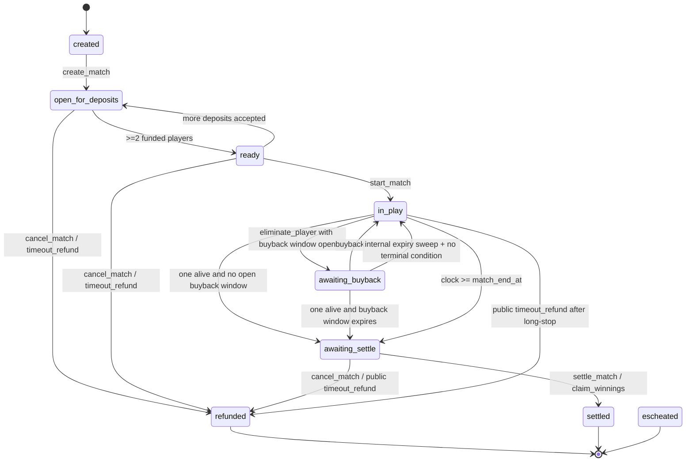

# SolShot N-Player Idle Escrow Research Report

## Executive summary

The safest practical architecture for SolShot is a new `solshot-escrow-v2` program, not an in-place extension of the current 1v1 program. V2 should keep Mongo as the source of truth for gameplay detail, but move all money-relevant facts on chain: the list of depositors, each player’s principal contribution, each player’s buyback contribution count and total, who is currently alive, elimination order, the fixed payout policy selected at creation, and the fixed fee recipients copied into the match at creation time. Funds should live in separate vault PDAs, not in the state account. Settlement should be permissionless whenever the terminal condition is deterministic, and a public timeout-refund path should exist for every non-settled match. That combination removes Mongo and server liveness as single points of failure for user funds, while still respecting SolShot’s server-authoritative game logic. citeturn13search4turn19search1turn18search2turn21view0turn22view0

My recommended launch shape is:

- **Ship a new program ID** for all new async group matches; leave v1 alive only to settle or cancel outstanding v1 matches.
- **Store depositor records on chain** in fixed-capacity player slots for up to 10 players.
- **Split state from vaults**: one `Match` account plus a `main_vault` PDA, and, if buyback is enabled, a second `buyback_vault` PDA.
- **Make payout recipients immutable per match** by copying treasury and ops addresses from config into the match at creation time.
- **Make settlement permissionless** when the result is deterministic; expose a `claim_winnings` convenience path for the winner in the single-winner case.
- **Make timeout refund public** after `match_end_at + 24h`, refunding each contributor’s principal and buybacks in full if settlement has not happened.
- **Phase buyback in later** behind a feature flag. If you insist on launch-day buyback, use a separate vault, one buyback per player, a short immediate buyback window, and a winner-only distribution for the buyback pot. citeturn0search0turn0search1turn1search0turn19search10turn14view3turn5view1

A compact architecture sketch is below.

```text
                       ┌──────────────────────────┐
                       │      ProgramConfig       │
                       │  authority / pause /     │
                       │  max wager / defaults    │
                       └────────────┬─────────────┘
                                    │
                    create_match    │
                                    ▼
                ┌───────────────────────────────┐
                │            Match              │
                │ status / host / fee copies /  │
                │ policies / deadlines /        │
                │ player_slots[10] / event_seq  │
                └───────────┬─────────┬─────────┘
                            │         │
                            │         │ optional if buyback enabled
                            │         ▼
                            │   ┌──────────────┐
                            │   │ buyback_vault│
                            │   │ lamports only│
                            │   └──────────────┘
                            ▼
                     ┌──────────────┐
                     │  main_vault  │
                     │ lamports only│
                     └──────────────┘

Deposits:   player signs -> main_vault
Buybacks:   player signs -> buyback_vault
Eliminate:  server authority updates Match only
Settle:     permissionless / winner-callable, atomic
Refund:     permissionless after long-stop, atomic
```

The three largest risks are not rent or raw transaction size; they are **wrong-outcome risk from bad off-chain elimination state**, **server-authority misuse during a long-running match**, and **state drift between chain and Mongo if a write lands on chain but not in Mongo**. The design below directly addresses all three by recording irreversible economic state transitions on chain, narrowing what the server key can do, and making reconciliation event-driven and idempotent. citeturn21view0turn22view0turn22view1turn22view2turn14view3turn5view1

For a solo-founder team, the realistic implementation budget is roughly **four to six engineering weeks** for contract, backend, client, reconciliation jobs, devnet soak, and remediation, followed by an **external audit window of roughly two to five weeks elapsed**. Public examples show a five-week full-time engagement for a comparable Solana program audit by entity["organization","Halborn","security firm"], while current audit-firm market commentary puts small-to-medium contract audits in the low-five-figure to mid-five-figure USD range; that should be treated as directional, not a quote. citeturn16view0turn5view1turn6search7

A final note on sources: I reviewed public material from entity["organization","Magic Eden","NFT marketplace"], entity["organization","Tensor","NFT marketplace"], entity["organization","Drift Protocol","defi exchange"], entity["organization","Mango Markets","defi exchange"], entity["organization","Squads","multisig platform"], entity["company","Helius","solana rpc provider"], entity["organization","Triton One","solana rpc provider"], entity["organization","Sec3","security firm"], and the official Solana and Anchor documentation; those references strongly support the conservative, fixed-policy, refund-first design recommended here. citeturn9view3turn9view2turn17search2turn7search2turn22view4turn22view5turn22view0turn22view1turn22view2turn16view2turn13search4turn19search1

## State machine and account layout

### State machine diagram

The required state machine needs one additional state that is missing from the brief: **`awaiting_buyback`**. Without it, you do not have a clean place to model the short period after a player is eliminated but before a configured buyback window expires or is exercised.



The critical behavioural choice is this: if buyback exists, elimination cannot immediately imply terminal settlement. The contract must check that all buyback windows are closed before allowing the final settle path. That is the main reason I recommend gating buyback to a later rollout phase. citeturn0search0turn1search1turn19search10

### Account layout

The sizes below assume you deliberately round the match account up to a clean **1024 bytes total allocation** to leave upgrade headroom. On Solana, the rent-exempt minimum depends on total allocated bytes, with the current documented formula effectively using `(allocated_bytes + 128) * 3480 * 2`, and rent reserves are recovered when accounts are closed. Anchor also requires an 8-byte discriminator in each account allocation. citeturn0search1turn19search1turn19search8turn18search3turn12calculator0turn12calculator2

| PDA / account | Seeds | Purpose | Suggested total allocation | Approx. rent-exempt reserve |
|---|---|---:|---:|---:|
| `ProgramConfig` | `["config"]` | global authority, pause flag, wager caps, default policies | 256 bytes | ~0.00267 SOL |
| `Match` | `["match", match_id]` | all state and player slots | 1024 bytes | ~0.00802 SOL |
| `main_vault` | `["vault", "main", match_id]` | principal deposits only | 48 bytes | ~0.001225 SOL |
| `buyback_vault` | `["vault", "buyback", match_id]` | buyback deposits only | 48 bytes | ~0.001225 SOL |

That means a two-pot match costs roughly **0.01047 SOL** in temporary rent reserve across match plus both vault accounts, with the reserve returned on account close; this is not economically meaningful relative to your target pot sizes, but it should be funded by the server-side create payer, not silently taken from player principal. I would send reclaimed rent reserve to the match’s fixed ops wallet on close, not merge it into player payouts, because it is platform-funded working capital rather than user stake. citeturn12calculator0turn0search1turn18search3

### Direct answers to the program-design and lifecycle questions

**4.1.1 — On-chain depositor records or off-chain Mongo?**  
Use **on-chain player slots**. At 10 players, the rent delta is tiny, settlement is still comfortably O(n), and the trust reduction is enormous. If Mongo dies, on-chain player slots plus events still let you recover who funded what and who was later eliminated. Off-chain-only funding records make recovery and public timeout refunds dangerously dependent on a database that the brief explicitly treats as a possible failure point. citeturn0search1turn19search1turn22view0

**Trade-off matrix**

| Criterion | On-chain fixed player slots | Off-chain Mongo only |
|---|---|---|
| Rent at 10 players | Small, measurable, acceptable | Lower |
| Settle complexity | O(n), fine at n≤10 | Lower on chain, higher off chain |
| Trust assumption | Server cannot invent recipients outside recorded contributors | Server controls effective ledger |
| Mongo-loss recovery | Strong | Weak |
| Public timeout refund | Straightforward | Hard / unsafe |
| Auditability from chain alone | Good | Poor |

**4.1.2 — Separate PDA for buyback pot or sub-field in main escrow?**  
Use a **separate buyback vault PDA** and keep the buyback accounting fields in the `Match` account. That gives you a separate ledger without a second state account. The operational gain is that you can inspect, cap, refund, or even later re-price buybacks without mixing them into principal accounting. I do **not** recommend a separate `BuybackState` account at this scale; it adds rent and migration overhead without adding much safety. This mirrors the general escrow pattern of separate state and fund holder accounts seen across audited Solana codebases. citeturn18search2turn13search4turn9view4

**4.1.3 — Allocate for max or use dynamic resize?**  
Allocate **once, at the hard cap**, and avoid dynamic resize entirely. Solana supports growth, but account reallocation brings extra rent-payer handling and migration surface, while your hard cap is only 10 players. The safety win from fixed-size accounts is greater than the tiny rent saving from tight per-match sizing. citeturn0search1turn19search1turn19search10

**4.1.4 — Separate `escrow_state` from `escrow_vault`?**  
Yes. Keep `Match` and vault PDAs separate. Production Solana patterns regularly separate state from balances; it simplifies accounting, closure, replay inspection, and future tokenisation, and it makes it easier to reason about vault balances net of rent reserve. The Solana Cookbook also explicitly documents the program-owned-account pattern for transferring lamports without an extra CPI when the source account is program-owned. citeturn18search2turn13search4

**4.1.5 — Upgrade in place or freeze v1 and use v2?**  
Use a **new program ID** for v2 and freeze v1 to “settle or cancel only”. Solana programs are upgradable when an upgrade authority exists, and Anchor now has migration helpers, but schema migration across live financial accounts is exactly the sort of footgun that public audit reports repeatedly punish. For SolShot, the cleaner path is coexistence, not live migration. citeturn13search0turn13search1turn13search3turn14view3turn5view1

**4.2.6 — Full state machine recommendation**  
The state machine above is the correct one for this feature set: `created → open_for_deposits → ready → in_play → awaiting_buyback → awaiting_settle → settled | refunded`, with `escheated` reserved but disabled at launch.

**4.2.7 — Idempotency guards**  
Every instruction should be idempotent through state and slot checks, not a generic nonce:

- `create_match`: fail if PDA already exists.
- `deposit_wager`: fail if player already has a funded slot.
- `start_match`: fail unless `state in {open_for_deposits, ready}` and `started_at == 0`.
- `buyback`: fail unless player is eliminated, has buyback budget remaining, and the buyback window is still open.
- `eliminate_player`: fail unless player is currently `Alive`.
- `settle_match` / `claim_winnings`: fail unless status is terminal and not already settled or refunded.
- `cancel_match`: fail if already settled or refunded.  
Because all of those mutate the same `Match` PDA, Solana’s account locking already serialises the dangerous races; your job is to ensure the second transaction fails cleanly after the first one changes state. citeturn13search9turn19search6turn19search10

**4.2.8 — Core correctness invariants**  
These should exist as `require!` checks or internal asserts:

| Invariant | Where enforced |
|---|---|
| `2 <= max_players <= 10` | `create_match` |
| `wager_lamports > 0 && wager_lamports <= config.max_wager_lamports` | `create_match` |
| `treasury_fee_bps + ops_fee_bps < 10_000` | `create_match`, config update |
| `deposited_players <= max_players` | deposit, refund |
| `alive_players <= deposited_players` | start, eliminate, buyback |
| `principal_total == sum(player.deposit_lamports)` | deposit, cancel, settle |
| `buyback_total == sum(player.buyback_paid_lamports)` | buyback, cancel, settle |
| `main_vault.lamports >= rent_floor + principal_total` | after deposit, before settle/refund |
| `buyback_vault.lamports >= rent_floor + buyback_total` | after buyback, before settle/refund |
| `winner / payout recipients must be match contributors` | settle |
| `no payout recipient outside {contributors, treasury, ops}` | settle |
| `buyback only before match_end_at` | buyback |
| `no elimination, no buyback after hard timeout` | eliminate, buyback |
| `settled_at > 0 xor refunded_at > 0` | settle, cancel |
| `event_seq` strictly increases on every write | every mutating instruction |

Public Solana and Anchor security references, plus recurring public audit findings, strongly support this explicit invariant style: owner checks, signer checks, duplicate-account checks, checked arithmetic, and anti-fund-lock logic are recurring sources of bugs and audit findings. citeturn19search10turn19search4turn14view3turn5view1

## Instruction spec and code-level recommendations

### Recommended Rust account model

I do **not** recommend a dedicated `BuybackState` account. Use one `Match` account, plus vault PDAs.

```rust
use anchor_lang::prelude::*;

pub const MAX_PLAYERS: usize = 10;
pub const MATCH_SPACE: usize = 1024; // total allocated bytes, incl. discriminator
pub const CONFIG_SPACE: usize = 256;
pub const VAULT_SPACE: usize = 48;

#[repr(u8)]
#[derive(AnchorSerialize, AnchorDeserialize, Clone, Copy, PartialEq, Eq)]
pub enum MatchStatus {
    Created = 0,
    OpenForDeposits = 1,
    Ready = 2,
    InPlay = 3,
    AwaitingBuyback = 4,
    AwaitingSettle = 5,
    Settled = 6,
    Refunded = 7,
    Escheated = 8, // reserved, disabled at launch
}

#[repr(u8)]
#[derive(AnchorSerialize, AnchorDeserialize, Clone, Copy, PartialEq, Eq)]
pub enum PlayerStatus {
    Empty = 0,
    Registered = 1,  // deposited but not started
    Alive = 2,
    Eliminated = 3,
    Forfeited = 4,
    Paid = 5,
    Refunded = 6,
}

#[repr(u8)]
#[derive(AnchorSerialize, AnchorDeserialize, Clone, Copy, PartialEq, Eq)]
pub enum PayoutPolicy {
    WinnerTakeAll = 0,
    Top3_60_30_10 = 1, // phase 2, not default
}

#[repr(u8)]
#[derive(AnchorSerialize, AnchorDeserialize, Clone, Copy, PartialEq, Eq)]
pub enum TimeoutPolicy {
    RefundAllAfterGrace = 0,
    SplitAliveEqual = 1, // recommended for timed-out in-play matches
}

#[repr(u8)]
#[derive(AnchorSerialize, AnchorDeserialize, Clone, Copy, PartialEq, Eq)]
pub enum BuybackMode {
    Disabled = 0,
    SeparateVaultWinnerOnly = 1,
}

#[repr(u8)]
#[derive(AnchorSerialize, AnchorDeserialize, Clone, Copy, PartialEq, Eq)]
pub enum VaultKind {
    Main = 0,
    Buyback = 1,
}

#[repr(u8)]
#[derive(AnchorSerialize, AnchorDeserialize, Clone, Copy, PartialEq, Eq)]
pub enum EliminationReason {
    HpZero = 0,
    ExplicitForfeit = 1,
    Inactivity = 2,
    Timeout = 3,
}

#[derive(AnchorSerialize, AnchorDeserialize, Clone, Copy, Default)]
pub struct PlayerSlot {
    pub wallet: Pubkey,
    pub deposit_lamports: u64,
    pub buyback_paid_lamports: u64,
    pub joined_at: i64,
    pub eliminated_at: i64,
    pub buyback_deadline_at: i64,
    pub finish_rank: u8,     // 1 = winner
    pub buyback_count: u8,
    pub status: u8,          // PlayerStatus
    pub reserved: [u8; 5],
}

#[account]
pub struct ProgramConfig {
    pub version: u16,
    pub bump: u8,
    pub paused_new_matches: bool,
    pub server_authority: Pubkey,           // can later be a Squads vault PDA
    pub pending_server_authority: Pubkey,   // 2-step rotation
    pub default_treasury: Pubkey,
    pub default_ops: Pubkey,
    pub treasury_fee_bps: u16,
    pub ops_fee_bps: u16,
    pub max_wager_lamports: u64,
    pub default_settle_grace_secs: i64,
    pub reserved: [u8; 159],
}

#[account]
pub struct Match {
    pub version: u16,
    pub status: u8,
    pub payout_policy: u8,
    pub timeout_policy: u8,
    pub buyback_mode: u8,

    pub match_bump: u8,
    pub main_vault_bump: u8,
    pub buyback_vault_bump: u8,

    pub max_players: u8,
    pub deposited_players: u8,
    pub alive_players: u8,
    pub elimination_count: u8,
    pub max_buybacks_per_player: u8,
    pub reserved_flags: [u8; 3],

    pub host: Pubkey,
    pub treasury: Pubkey, // copied from config at create time
    pub ops: Pubkey,      // copied from config at create time

    pub wager_lamports: u64,
    pub buyback_price_lamports: u64,
    pub principal_total_lamports: u64,
    pub buyback_total_lamports: u64,

    pub created_at: i64,
    pub deposits_close_at: i64,
    pub started_at: i64,
    pub match_end_at: i64,
    pub settle_grace_ends_at: i64,
    pub settled_at: i64,
    pub refunded_at: i64,

    pub event_seq: u64,
    pub players: [PlayerSlot; MAX_PLAYERS],
    pub reserved: [u8; 96],
}

#[account]
pub struct Vault {
    pub match_key: Pubkey,
    pub kind: u8, // VaultKind
    pub bump: u8,
    pub reserved: [u8; 6],
}
```

The most important design choice in that model is that **treasury and ops are copied into each match** at creation time. That prevents a later config change from silently changing the fee recipients for an in-flight match, which is precisely the kind of administrative surprise you want to eliminate in a long-running escrow. Public audits have repeatedly flagged ownership-transfer and locked-fund issues; match-local fee copies and timeout refunds are the cleanest answer here. citeturn14view3turn5view1

### Recommended events and errors

```rust
#[event]
pub struct MatchCreatedEvent {
    pub match_key: Pubkey,
    pub host: Pubkey,
    pub wager_lamports: u64,
    pub max_players: u8,
    pub payout_policy: u8,
    pub buyback_mode: u8,
    pub event_seq: u64,
}

#[event]
pub struct DepositRecordedEvent {
    pub match_key: Pubkey,
    pub player: Pubkey,
    pub amount_lamports: u64,
    pub slot_index: u8,
    pub event_seq: u64,
}

#[event]
pub struct MatchStartedEvent {
    pub match_key: Pubkey,
    pub deposited_players: u8,
    pub alive_players: u8,
    pub event_seq: u64,
}

#[event]
pub struct PlayerEliminatedEvent {
    pub match_key: Pubkey,
    pub player: Pubkey,
    pub reason: u8,
    pub finish_rank: u8,
    pub buyback_deadline_at: i64,
    pub event_seq: u64,
}

#[event]
pub struct BuybackRecordedEvent {
    pub match_key: Pubkey,
    pub player: Pubkey,
    pub amount_lamports: u64,
    pub buyback_count: u8,
    pub event_seq: u64,
}

#[event]
pub struct MatchSettledEvent {
    pub match_key: Pubkey,
    pub gross_lamports: u64,
    pub treasury_fee_lamports: u64,
    pub ops_fee_lamports: u64,
    pub payout_count: u8,
    pub event_seq: u64,
}

#[event]
pub struct MatchRefundedEvent {
    pub match_key: Pubkey,
    pub contributor_count: u8,
    pub event_seq: u64,
}

#[error_code]
pub enum EscrowError {
    #[msg("max_players must be between 2 and 10")]
    InvalidPlayerCount,
    #[msg("wager amount is invalid")]
    InvalidWager,
    #[msg("buyback is disabled")]
    BuybackDisabled,
    #[msg("state transition is invalid")]
    InvalidState,
    #[msg("player already funded")]
    AlreadyDeposited,
    #[msg("player not found")]
    PlayerNotFound,
    #[msg("player is not alive")]
    PlayerNotAlive,
    #[msg("buyback window closed")]
    BuybackWindowClosed,
    #[msg("buyback limit reached")]
    BuybackLimitReached,
    #[msg("match not yet terminal")]
    MatchNotTerminal,
    #[msg("match already settled")]
    MatchAlreadySettled,
    #[msg("match already refunded")]
    MatchAlreadyRefunded,
    #[msg("recipient is not an authorized payout account")]
    UnauthorizedRecipient,
    #[msg("arithmetic overflow")]
    ArithmeticOverflow,
    #[msg("duplicate writable account")]
    DuplicateWritableAccount,
    #[msg("new match creation is paused")]
    Paused,
}
```

The brief’s non-negotiable says all writes must be audited via `emit!`. That is compatible with this design, but Anchor’s own docs warn that program logs can be truncated by some providers. So the implementation should use `emit!` as required, while the indexer should consume **full transactions** or a **Geyser/gRPC stream**, not a simple logs subscription. citeturn21view0turn22view0turn22view1turn22view2

### Instruction-by-instruction spec

#### `create_match`

**Purpose**  
Initialises match state and vault PDAs.

**Accounts**  
`config`, `server_authority` signer, `payer` signer, `match` PDA init, `main_vault` PDA init, optional `buyback_vault` PDA init, `system_program`.

**Args**  
`match_id`, `host`, `wager_lamports`, `max_players`, `deposits_close_at`, `match_end_at`, `payout_policy`, `timeout_policy`, `buyback_mode`, `buyback_price_lamports`, `max_buybacks_per_player`.

**Checks**  
Circuit breaker off; `2 <= max_players <= 10`; wager within cap; deadlines sane; fee bps sane; if top-3 selected, `max_players >= 5`; if buyback enabled, price > wager and max buybacks <= 1 for v2.

**Side effects**  
Creates match and vaults; copies treasury, ops, and fee schedule from config into the match; status becomes `OpenForDeposits`; emits `MatchCreatedEvent`.

```rust
pub fn create_match(ctx: Context<CreateMatch>, args: CreateMatchArgs) -> Result<()> {
    let cfg = &ctx.accounts.config;
    require!(!cfg.paused_new_matches, EscrowError::Paused);
    require!((2..=10).contains(&args.max_players), EscrowError::InvalidPlayerCount);
    require!(args.wager_lamports > 0 && args.wager_lamports <= cfg.max_wager_lamports, EscrowError::InvalidWager);
    require!(args.deposits_close_at < args.match_end_at, EscrowError::InvalidState);

    let now = Clock::get()?.unix_timestamp;
    let m = &mut ctx.accounts.match;

    m.version = 2;
    m.status = MatchStatus::OpenForDeposits as u8;
    m.payout_policy = args.payout_policy as u8;
    m.timeout_policy = args.timeout_policy as u8;
    m.buyback_mode = args.buyback_mode as u8;
    m.max_players = args.max_players;
    m.max_buybacks_per_player = args.max_buybacks_per_player;
    m.host = args.host;
    m.treasury = cfg.default_treasury;
    m.ops = cfg.default_ops;
    m.wager_lamports = args.wager_lamports;
    m.buyback_price_lamports = args.buyback_price_lamports;
    m.created_at = now;
    m.deposits_close_at = args.deposits_close_at;
    m.match_end_at = args.match_end_at;
    m.settle_grace_ends_at = args.match_end_at + cfg.default_settle_grace_secs;
    m.event_seq = 1;

    ctx.accounts.main_vault.match_key = m.key();
    ctx.accounts.main_vault.kind = VaultKind::Main as u8;
    if let Some(buyback_vault) = ctx.accounts.buyback_vault.as_deref_mut() {
        buyback_vault.match_key = m.key();
        buyback_vault.kind = VaultKind::Buyback as u8;
    }

    emit!(MatchCreatedEvent {
        match_key: m.key(),
        host: args.host,
        wager_lamports: args.wager_lamports,
        max_players: args.max_players,
        payout_policy: m.payout_policy,
        buyback_mode: m.buyback_mode,
        event_seq: m.event_seq,
    });
    Ok(())
}
```

#### `deposit_wager`

**Purpose**  
Lets a player self-fund one principal deposit.

**Accounts**  
`player` signer, `match`, `main_vault`, `system_program`.

**Args**  
None beyond `match_id` in PDA derivation.

**Checks**  
Match open or ready; deposit window still open; player not already funded; space exists.

**Side effects**  
Transfers exact wager into main vault; inserts or updates player slot; increments `deposited_players`; updates status to `Ready` when count reaches 2; emits `DepositRecordedEvent`.

```rust
pub fn deposit_wager(ctx: Context<DepositWager>) -> Result<()> {
    let m = &mut ctx.accounts.match;
    let now = Clock::get()?.unix_timestamp;

    require!(
        m.status == MatchStatus::OpenForDeposits as u8 || m.status == MatchStatus::Ready as u8,
        EscrowError::InvalidState
    );
    require!(now <= m.deposits_close_at, EscrowError::InvalidState);

    let slot = find_or_assign_empty_slot(m, ctx.accounts.player.key())?;
    require!(m.players[slot].deposit_lamports == 0, EscrowError::AlreadyDeposited);

    anchor_lang::system_program::transfer(
        CpiContext::new(
            ctx.accounts.system_program.to_account_info(),
            anchor_lang::system_program::Transfer {
                from: ctx.accounts.player.to_account_info(),
                to: ctx.accounts.main_vault.to_account_info(),
            },
        ),
        m.wager_lamports,
    )?;

    let p = &mut m.players[slot];
    p.wallet = ctx.accounts.player.key();
    p.deposit_lamports = m.wager_lamports;
    p.joined_at = now;
    p.status = PlayerStatus::Registered as u8;

    m.principal_total_lamports = m.principal_total_lamports
        .checked_add(m.wager_lamports)
        .ok_or(EscrowError::ArithmeticOverflow)?;
    m.deposited_players += 1;
    if m.deposited_players >= 2 {
        m.status = MatchStatus::Ready as u8;
    }
    m.event_seq += 1;

    emit!(DepositRecordedEvent {
        match_key: m.key(),
        player: ctx.accounts.player.key(),
        amount_lamports: m.wager_lamports,
        slot_index: slot as u8,
        event_seq: m.event_seq,
    });
    Ok(())
}
```

#### `start_match`

**Purpose**  
Moves the match from funded lobby to in-play.

**Accounts**  
`server_authority` signer, `match`.

**Checks**  
State open or ready; `deposited_players >= 2`; not already started.

**Side effects**  
Marks all funded players `Alive`; sets `alive_players`; sets `started_at`; status becomes `InPlay`; emits `MatchStartedEvent`.

```rust
pub fn start_match(ctx: Context<StartMatch>) -> Result<()> {
    let m = &mut ctx.accounts.match;
    require!(
        m.status == MatchStatus::OpenForDeposits as u8 || m.status == MatchStatus::Ready as u8,
        EscrowError::InvalidState
    );
    require!(m.deposited_players >= 2, EscrowError::InvalidState);
    require!(m.started_at == 0, EscrowError::InvalidState);

    for player in m.players.iter_mut() {
        if player.deposit_lamports > 0 {
            player.status = PlayerStatus::Alive as u8;
        }
    }

    m.started_at = Clock::get()?.unix_timestamp;
    m.alive_players = m.deposited_players;
    m.status = MatchStatus::InPlay as u8;
    m.event_seq += 1;

    emit!(MatchStartedEvent {
        match_key: m.key(),
        deposited_players: m.deposited_players,
        alive_players: m.alive_players,
        event_seq: m.event_seq,
    });
    Ok(())
}
```

#### `buyback`

**Purpose**  
Lets an eliminated player pay the configured buyback amount into the buyback vault.

**Accounts**  
`player` signer, `match`, `buyback_vault`, `system_program`.

**Checks**  
Buyback enabled; player exists; player currently eliminated or forfeited; buyback limit not reached; current time before `buyback_deadline_at` and before `match_end_at`.

**Side effects**  
Transfers buyback amount into buyback vault; increments player buyback counters and match total; status returns to `Alive`; increments `alive_players`; emits `BuybackRecordedEvent`.

```rust
pub fn buyback(ctx: Context<Buyback>) -> Result<()> {
    let m = &mut ctx.accounts.match;
    let now = Clock::get()?.unix_timestamp;
    require!(m.buyback_mode == BuybackMode::SeparateVaultWinnerOnly as u8, EscrowError::BuybackDisabled);
    require!(now < m.match_end_at, EscrowError::BuybackWindowClosed);

    let slot = find_slot(m, ctx.accounts.player.key())?;
    let p = &mut m.players[slot];

    require!(
        p.status == PlayerStatus::Eliminated as u8 || p.status == PlayerStatus::Forfeited as u8,
        EscrowError::InvalidState
    );
    require!(p.buyback_count < m.max_buybacks_per_player, EscrowError::BuybackLimitReached);
    require!(now <= p.buyback_deadline_at, EscrowError::BuybackWindowClosed);

    anchor_lang::system_program::transfer(
        CpiContext::new(
            ctx.accounts.system_program.to_account_info(),
            anchor_lang::system_program::Transfer {
                from: ctx.accounts.player.to_account_info(),
                to: ctx.accounts.buyback_vault.to_account_info(),
            },
        ),
        m.buyback_price_lamports,
    )?;

    p.buyback_count += 1;
    p.buyback_paid_lamports = p.buyback_paid_lamports
        .checked_add(m.buyback_price_lamports)
        .ok_or(EscrowError::ArithmeticOverflow)?;
    p.status = PlayerStatus::Alive as u8;
    p.eliminated_at = 0;
    p.buyback_deadline_at = 0;
    p.finish_rank = 0;

    m.buyback_total_lamports = m.buyback_total_lamports
        .checked_add(m.buyback_price_lamports)
        .ok_or(EscrowError::ArithmeticOverflow)?;
    m.alive_players += 1;
    m.status = MatchStatus::InPlay as u8;
    m.event_seq += 1;

    emit!(BuybackRecordedEvent {
        match_key: m.key(),
        player: ctx.accounts.player.key(),
        amount_lamports: m.buyback_price_lamports,
        buyback_count: p.buyback_count,
        event_seq: m.event_seq,
    });
    Ok(())
}
```

#### `eliminate_player`

**Purpose**  
Marks a player as eliminated or forfeited and stores rank-relevant order.

**Accounts**  
`server_authority` signer, `match`.

**Args**  
`player`, `reason`.

**Checks**  
Match in play or awaiting buyback; player alive; match not timed out already.

**Side effects**  
Sets `finish_rank`; decrements `alive_players`; if buyback enabled, opens short buyback window and enters `AwaitingBuyback`; otherwise if one alive remains or hard timeout has arrived, enters `AwaitingSettle`; emits `PlayerEliminatedEvent`.

```rust
pub fn eliminate_player(
    ctx: Context<EliminatePlayer>,
    player: Pubkey,
    reason: EliminationReason,
    buyback_window_secs: i64,
) -> Result<()> {
    let m = &mut ctx.accounts.match;
    let now = Clock::get()?.unix_timestamp;
    expire_buyback_windows_if_needed(m, now)?;

    require!(
        m.status == MatchStatus::InPlay as u8 || m.status == MatchStatus::AwaitingBuyback as u8,
        EscrowError::InvalidState
    );
    require!(now < m.match_end_at, EscrowError::InvalidState);

    let slot = find_slot(m, player)?;
    let p = &mut m.players[slot];
    require!(p.status == PlayerStatus::Alive as u8, EscrowError::PlayerNotAlive);

    p.status = match reason {
        EliminationReason::ExplicitForfeit | EliminationReason::Inactivity => PlayerStatus::Forfeited as u8,
        _ => PlayerStatus::Eliminated as u8,
    };
    p.eliminated_at = now;
    p.finish_rank = m.alive_players; // alive before decrement = their final standing
    m.alive_players -= 1;
    m.elimination_count += 1;

    if m.buyback_mode == BuybackMode::SeparateVaultWinnerOnly as u8
        && p.buyback_count < m.max_buybacks_per_player
    {
        p.buyback_deadline_at = now + buyback_window_secs;
        m.status = MatchStatus::AwaitingBuyback as u8;
    } else if m.alive_players <= 1 {
        m.status = MatchStatus::AwaitingSettle as u8;
    } else {
        m.status = MatchStatus::InPlay as u8;
    }

    m.event_seq += 1;

    emit!(PlayerEliminatedEvent {
        match_key: m.key(),
        player,
        reason: reason as u8,
        finish_rank: p.finish_rank,
        buyback_deadline_at: p.buyback_deadline_at,
        event_seq: m.event_seq,
    });
    Ok(())
}
```

#### `settle_match`

**Purpose**  
Atomic settlement of principal, buyback pot, fees, vault closure, and match closure.

**Accounts**  
`payer`, `match`, `main_vault`, optional `buyback_vault`, writable recipient accounts for all contributors that will receive payouts, writable `treasury`, writable `ops`.

**Checks**  
Terminal condition is satisfied: either one alive and no open buyback windows, or `clock >= match_end_at`. For timeout splits, compute recipients from alive set. Every payout account must either be a contributor in `player_slots` or the fixed `treasury`/`ops`.

**Side effects**  
Computes fees and net payouts using integer arithmetic only; moves funds atomically; emits `MatchSettledEvent`; closes vaults and match.

```rust
pub fn settle_match(ctx: Context<SettleMatch>) -> Result<()> {
    let m = &mut ctx.accounts.match;
    let now = Clock::get()?.unix_timestamp;
    expire_buyback_windows_if_needed(m, now)?;

    require!(
        m.status == MatchStatus::AwaitingSettle as u8 || now >= m.match_end_at,
        EscrowError::MatchNotTerminal
    );
    require!(m.settled_at == 0 && m.refunded_at == 0, EscrowError::InvalidState);

    let gross = m.principal_total_lamports
        .checked_add(m.buyback_total_lamports)
        .ok_or(EscrowError::ArithmeticOverflow)?;

    let treasury_fee = ((gross as u128) * 700u128 / 10_000u128) as u64;
    let ops_fee = ((gross as u128) * 300u128 / 10_000u128) as u64;
    let net = gross
        .checked_sub(treasury_fee)
        .and_then(|v| v.checked_sub(ops_fee))
        .ok_or(EscrowError::ArithmeticOverflow)?;

    let recipients = compute_recipients(m, now)?;
    disburse_net_atomic(net, &recipients, &ctx.remaining_accounts)?;
    transfer_from_vaults_to_fixed_fee_accounts(treasury_fee, ops_fee, &ctx)?;
    close_vaults_and_match(&ctx, m.ops)?; // rent reserve back to fixed ops wallet

    m.settled_at = now;
    m.status = MatchStatus::Settled as u8;
    m.event_seq += 1;

    emit!(MatchSettledEvent {
        match_key: m.key(),
        gross_lamports: gross,
        treasury_fee_lamports: treasury_fee,
        ops_fee_lamports: ops_fee,
        payout_count: recipients.len() as u8,
        event_seq: m.event_seq,
    });
    Ok(())
}
```

#### `cancel_match`

**Purpose**  
Covers both pre-start cancellation and public timeout refund.

**Accounts**  
`payer`, `match`, `main_vault`, optional `buyback_vault`, all contributor writable accounts.

**Checks**  
Either pre-start and authorised / expired lobby, or post-start and `now >= settle_grace_ends_at`; not already settled or refunded.

**Side effects**  
Refunds each contributor exactly `deposit_lamports + buyback_paid_lamports`; closes vaults and match; emits `MatchRefundedEvent`.

```rust
pub fn cancel_match(ctx: Context<CancelMatch>) -> Result<()> {
    let m = &mut ctx.accounts.match;
    let now = Clock::get()?.unix_timestamp;

    let pre_start = m.started_at == 0 &&
        (ctx.accounts.server_authority.is_some() || now > m.deposits_close_at);

    let timeout_refund = now >= m.settle_grace_ends_at;

    require!(pre_start || timeout_refund, EscrowError::InvalidState);
    require!(m.settled_at == 0 && m.refunded_at == 0, EscrowError::InvalidState);

    for p in m.players.iter().filter(|p| p.deposit_lamports > 0) {
        let owed = p.deposit_lamports
            .checked_add(p.buyback_paid_lamports)
            .ok_or(EscrowError::ArithmeticOverflow)?;
        refund_contributor_atomic(p.wallet, owed, &ctx.remaining_accounts)?;
    }

    close_vaults_and_match(&ctx, m.ops)?;
    m.refunded_at = now;
    m.status = MatchStatus::Refunded as u8;
    m.event_seq += 1;

    emit!(MatchRefundedEvent {
        match_key: m.key(),
        contributor_count: m.deposited_players,
        event_seq: m.event_seq,
    });
    Ok(())
}
```

#### `claim_winnings`

**Purpose**  
A client-facing convenience wrapper for the deterministic single-winner case.

**Accounts**  
Same as `settle_match`, but `winner` signer must equal the surviving player when there is exactly one alive and no open buyback windows.

**Checks**  
Single-winner only; caller is the winner.

**Side effects**  
Calls the same settlement internals as `settle_match`.

```rust
pub fn claim_winnings(ctx: Context<ClaimWinnings>) -> Result<()> {
    let winner = derive_single_winner(&ctx.accounts.match)?;
    require!(ctx.accounts.winner.key() == winner, EscrowError::UnauthorizedRecipient);
    settle_match(ctx.accounts.into_settle_context())
}
```

### Server-side interface and schema changes

The backend wrappers should become more explicit and more stateful than the current `escrow.js` abstraction, because they now need to support reconciliation and permissionless recovery. A concrete interface shape is below.

```ts
export type EscrowPayoutPolicy = "winner_take_all" | "top3_60_30_10";
export type EscrowTimeoutPolicy = "refund_all_after_grace" | "split_alive_equal";
export type EscrowBuybackMode = "disabled" | "separate_vault_winner_only";
export type EliminationReason = "hp_zero" | "explicit_forfeit" | "inactivity" | "timeout";

export interface CreateMatchEscrowInput {
  matchId: string;
  hostWallet: string;
  wagerLamports: bigint;
  maxPlayers: number;
  depositsCloseAt: number;
  matchEndAt: number;
  payoutPolicy: EscrowPayoutPolicy;
  timeoutPolicy: EscrowTimeoutPolicy;
  buybackMode: EscrowBuybackMode;
  buybackPriceLamports?: bigint;
  maxBuybacksPerPlayer?: number;
}

export interface EscrowServiceV2 {
  createMatch(input: CreateMatchEscrowInput): Promise<{ signature: string; matchPda: string }>;
  buildDepositTx(matchId: string, playerWallet: string): Promise<{ serializedTx: string }>;
  startMatch(matchId: string): Promise<{ signature: string }>;
  recordElimination(matchId: string, playerWallet: string, reason: EliminationReason): Promise<{ signature: string }>;
  buildBuybackTx(matchId: string, playerWallet: string): Promise<{ serializedTx: string }>;
  settleMatch(matchId: string): Promise<{ signature: string }>;
  buildClaimWinningsTx(matchId: string, winnerWallet: string): Promise<{ serializedTx: string }>;
  cancelMatch(matchId: string, mode: "pre_start" | "timeout_refund"): Promise<{ signature: string }>;
  reconcileMatch(matchId: string): Promise<ReconcileResult>;
}
```

For Mongo, add explicit chain mirroring fields.

```js
// Mongoose patch sketch
{
  escrowVersion: { type: Number, default: 2 },
  escrowProgramId: String,
  matchPda: String,
  mainVaultPda: String,
  buybackVaultPda: String,

  escrowState: {
    type: String,
    enum: [
      "created", "open_for_deposits", "ready", "in_play",
      "awaiting_buyback", "awaiting_settle", "settled", "refunded"
    ]
  },

  payoutPolicy: String,
  timeoutPolicy: String,
  buybackMode: String,
  buybackPriceLamports: String,
  settleGraceEndsAt: Date,

  chainEventSeqApplied: { type: Number, default: 0 },
  createTxSig: String,
  startTxSig: String,
  settleTxSig: String,
  refundTxSig: String,

  deposits: [{
    wallet: String,
    amountLamports: String,
    slotIndex: Number,
    txSig: String,
    confirmedAt: Date,
  }],

  buybacks: [{
    wallet: String,
    amountLamports: String,
    buybackCount: Number,
    txSig: String,
    confirmedAt: Date,
  }],

  eliminations: [{
    wallet: String,
    reason: String,
    finishRank: Number,
    buybackDeadlineAt: Date,
    txSig: String,
    confirmedAt: Date,
  }],

  reconciliation: {
    lastCheckedAt: Date,
    lastChainSlotSeen: Number,
    divergenceCode: String,
    divergedAt: Date,
  }
}
```

The lifecycle service in `groupchat/lifecycle.js` should change one fundamental thing: **every economically meaningful state edge becomes chain-first, Mongo-second**. That means `start`, `eliminate`, `buyback`, `settle`, and `refund` are not committed in Mongo until their transaction is confirmed and event-sequenced. Deposits and buybacks should be applied from chain events, not from client optimism. Because Helius explicitly recommends indexing full transactions with `getTransactionsForAddress`, and Anchor explicitly warns about log truncation, the reconciler should consume full transaction data or a Geyser stream, then apply idempotent upserts keyed by `(matchPda, eventSeq)`. citeturn22view0turn21view0turn22view1turn22view2

### Client and UX changes

The wallet interface can stay clean and mobile-friendly.

```ts
interface WalletContextValue {
  signAndSendEscrowDeposit(serializedTx: string, matchId: string): Promise<string>;
  signAndSendEscrowBuyback(serializedTx: string, matchId: string): Promise<string>;
  signAndSendClaimWinnings(serializedTx: string, matchId: string): Promise<string>;
}
```

For the Mini App flow, the most important UX recommendations are:

- **Deposit screen**: always show exact SOL amount, fee split, refund conditions, and deposit deadline.
- **Idle alerts**: push notification and in-app banner at “2h remaining”, “30m remaining”, and “1 missed turn away from auto-forfeit”.
- **Auto-skip policy**: recommended default is *auto-skip each missed turn, auto-forfeit after two consecutive missed turns or three total missed turns*. That is forgiving enough for mobile Telegram users, but it prevents deliberate table-hostage griefing.
- **Buyback prompt**: only if/when buyback is enabled; must show short timer, fixed price, whether this is the player’s final allowed buyback, and that funds go into a separate bonus pot.
- **Settlement receipt**: show gross pot, treasury fee, ops fee, principal pot, buyback pot, recipient list, and transaction signature.

### Long-running match safety and transaction-limit answers

**4.3.9 — Server key compromise or server unavailable for >24h**  
Do **not** pre-sign anything. Solana blockhashes are intentionally short-lived, and durable nonces explicitly remove the recent-blockhash expiry protection; Solana’s own docs warn that durable nonces remove expiry semantics, and public reporting on the 2026 Drift incident tied durable-nonce pre-signing to a major privileged-access compromise. The correct answer is not “pre-sign earlier”; it is “need fewer privileged signatures later”. So the recommended mitigation stack is: permissionless settle when terminal condition is deterministic, public timeout refund after `match_end_at + 24h`, circuit breaker for new matches, and moving the server authority and upgrade authority into a Squads-controlled signer as soon as possible. citeturn0search0turn1search1turn17search2turn22view4turn22view5

**4.3.10 — Rent over 7 days**  
Rent is not the real problem here. The cost is temporary and refunded on close. The operational question is simply who fronts it. My recommendation is: server create payer funds rent reserve; player principal is never used to backstop rent. citeturn0search1turn18search3turn12calculator0turn12calculator2

**4.3.11 — Mongo/chain drift**  
Chain is authoritative for money and economic transitions; Mongo is authoritative for gameplay detail. Reconciliation is by event sequence, not by timestamps. If a chain tx lands and Mongo misses it, the event stream backfills it. If Mongo says a deposit exists but no chain event ever finalised, the reconciler rolls it back to pending/failed. citeturn22view0turn21view0

**4.3.12 — Lost wallet mid-match**  
Do **not** let staff or host redirect payouts to a new wallet. In v2, that should be impossible by design. If a player loses the wallet, the claim or refund remains payable only to the original address. That is harsh, but it is exactly what “no single staffer can drain funds” implies. If you ever want wallet recovery, that is a separate custodial product decision, not a patch to this escrow. I would leave `Escheated` disabled unless and until you have counsel on abandoned-property handling.

**4.4.13 — Transaction-size fit**  
It fits without ALTs in v2. The documented Solana max transaction size is 1232 bytes, and every inline account key is 32 bytes. Even the worst-case timeout refund with 10 player recipient accounts, the match, up to two vaults, treasury, ops, payer, and program/system accounts still sits well under the byte cap. citeturn0search0turn1search0

**4.4.14 — Compute budget estimate**  
The default instruction budget is 200k compute units and the current documented max transaction budget is 1.4M. For this design, if you mutate lamports directly from program-owned vaults and avoid per-recipient CPIs, I would expect 10-player settle or refund to sit comfortably below 400k. I would set `setComputeUnitLimit` to **400_000** for settle and refund transactions and then profile on devnet. If you instead use repeated System Program transfer CPIs, keep more headroom. citeturn1search2turn18search2

**4.4.15 — ALT recommendation**  
No for the initial SOL-only v2. ALTs are valuable when you have many repeat non-signer accounts and need to compress them, but they add operational complexity, and the current account set already fits. Revisit ALTs only if you later add SPL-token settlement paths, associated token accounts, or more elaborate multisig execution bundles. citeturn1search0turn0search0

## Threat model and fail-safe patterns

### Threat model

The table below answers the threat questions in the order of the brief.

| Threat | Mitigation in this design | Residual risk |
|---|---|---|
| **4.5.16 Server-key compromise** | Server key can create/start/eliminate, but cannot send funds to arbitrary wallets; settle recipients are constrained to contributor slots plus fixed treasury/ops copied into the match. Use public settle, public timeout refund, two-step authority rotation, and move authority to Squads as soon as possible. | **Medium** for wrong-outcome / DoS, **Low** for theft |
| **4.5.17 MEV / front-running** | Settlement reveals winner, but there is no profitable external action if recipients are hard-constrained and the transaction is atomic. Main risk is simple transaction censorship or delay, not value extraction. | **Low** |
| **4.5.18 Replay attacks** | Rely on PDA state machine and slot checks, not a global nonce. Duplicate deposits, buys, eliminations, settles, and refunds fail because state already changed. | **Low** |
| **4.5.19 Griefing by inactivity** | Auto-skip missed turns; auto-forfeit after 2 consecutive or 3 cumulative missed turns; on-chain `eliminate_player(reason = inactivity)` records it. | **Medium** until product tuning stabilises |
| **4.5.20 Sybil buyback abuse** | If buyback is enabled, cap at one buyback per player, use a short immediate window, and charge a meaningfully punitive fixed price into a separate vault. Better yet, defer buyback to phase 2. | **Accept** if capped; **High** if uncapped |
| **4.5.21 RPC outage / rebalanced clusters** | Multi-provider reads and writes, transaction queue with fresh blockhash fetch at send time, Geyser or full-tx indexer, Helius plus Triton failover. | **Low** |
| **4.5.22 Mongo corruption / loss** | Rebuild all money-relevant state from chain events and match account contents; accept that full gameplay replay still needs Mongo or chat logs. | **Low** for funds, **Medium** for UX/history |

Public references materially support that posture. Solana and Anchor docs define the state/account model and warn about event-log truncation. Triton explicitly recommends dedicated nodes for reliable Geyser and says complete reliability needs two dedicated nodes. Helius recommends full-transaction indexing paths such as `getTransactionsForAddress`. Public audit reports repeatedly flag locked-funds bugs, missing arithmetic checks, and missing ownership transfer paths. citeturn22view0turn22view1turn22view2turn21view0turn14view3turn5view1

### Fail-safe pattern recommendations

| Pattern | Recommendation | Reasoning |
|---|---|---|
| **Public timeout-refund instruction** | **Implement now** | This is mandatory for the brief’s “no funds frozen beyond duration + 24h” requirement. |
| **Self-claim on win** | **Implement now** | Use it as a public or winner-callable atomic settle path, not as per-user withdrawal claims. |
| **Multisig settlement** | **Do not require per match in v2** | Good for admin and upgrade keys, bad for user UX and liveness in the match path. |
| **Slashable server bond** | **Do not implement in v2** | Public refund already covers user-funds safety; bond logic is extra economic complexity. |
| **On-chain match state checksum** | **Do not implement in v2** | A checksum from the same server that computes the game does not meaningfully prove correctness; record eliminations instead. |
| **Dispute / appeal window** | **Do not implement in v2 money path** | It increases frozen-fund risk and operational complexity. Use support tooling, not an on-chain appeal state, at launch. |
| **Hard cap on per-match wager** | **Implement now** | Strongly recommended for mainnet rollout. |
| **Circuit breaker** | **Implement now** | Pause new creates and deposits, but never block settle or refund on in-flight matches. |

### Economic recommendation on buyback and payouts

The buyback design space is where the product risk most exceeds the contract risk.

- **Design A, same-pot top-up** is simpler, but it muddies accounting and makes late buybacks feel like invisible principal inflation. It also makes public refund reporting less legible.
- **Design B, separate pot** costs one extra vault PDA but gives you a clean ledger boundary. That is worth it.  
- Among Design B payout patterns, **winner-only buyback bonus** is the only v2-safe option. HP-weighted or rebate-based patterns create too much off-chain discretion and too many collusion angles for the first launch.

So my recommendation is:

- **Default at launch**: no buyback in phase 1.
- **If buyback must ship**: separate buyback vault, one buyback per player, short immediate window, and 100% of the buyback pot to the final winner.

For standard settlement, the safest default is also the simplest:

- **Default**: `WinnerTakeAll` for natural finish.
- **Timeout with multiple alive**: `SplitAliveEqual`, not HP-proportional.
- **Custom path**: phase 2 only; use fixed audited presets, not arbitrary host-entered percentages.

The reason for the equal-split timeout fallback is not game elegance; it is that **equal split depends only on the on-chain alive set**, while HP-proportional settlement would depend on off-chain server state at the exact expiry moment and would widen the wrong-outcome blast radius.

## Reconciliation, operational runbook, test plan, and migration

### Reconciliation strategy

The reconciliation rule is simple:

- **On-chain** is the source of truth for funds and irreversible economic transitions.
- **Mongo** is the source of truth for mutable gameplay representation and UX.

That means the following must be mirrored from chain into Mongo and never originated only in Mongo:

- match creation
- principal deposits
- start
- eliminations / forfeits / inactivity eliminations
- buybacks
- settle
- refund

The recommended implementation pattern is:

1. `create_match` writes a Mongo draft row with `chainPending = true`.
2. Server submits tx.
3. Reconciler or synchronous confirmation step fetches full tx and decodes events.
4. Mongo row is upserted by `(matchPda, eventSeq)`.
5. Only then does the lifecycle service consider the edge final.

For historical backfill and drift correction, use a full-transaction path. Helius explicitly recommends `getTransactionsForAddress` for historical indexing, and Anchor explicitly recommends Geyser-backed solutions for more robust event capture because `emit!` logs can be truncated by data providers. Triton’s reliable stream docs also explicitly describe replayable persistent streams and high-availability merging across nodes. citeturn22view0turn21view0turn22view1turn22view2

The cron and sweeper set should be:

- **`reconcileRecentEscrowEvents`** — every minute; backfill and apply chain events idempotently.
- **`sweepLobbyTimeouts`** — refund unstarted matches after deposit deadline.
- **`sweepTurnTimeouts`** — off-chain governance of missed-turn counters; submit inactivity elimination when threshold hit.
- **`sweepTerminalMatches`** — if a match is terminal, submit `settle_match`, or notify the winner to self-claim.
- **`sweepHardTimeoutRefunds`** — if `now >= settle_grace_ends_at`, submit public timeout refund.
- **`rpcHealthCheckAndFailover`** — maintain provider quorum and fail open to backup submission providers.

### Direct answers to the compliance and rollout questions

**4.7.23 — Multi-winner settlement and legal classification**  
This is not legal advice, but the public legal materials are fairly consistent that the central tests usually turn on **prize, consideration, and chance**, or on whether chance is the dominant factor, not simply on whether there is one winner or three. The UK regulator’s skill-with-prizes guidance focuses on whether there is an appreciable chance element, and mainstream legal commentary on competitions similarly focuses on structure and whether the competition accidentally falls back into lottery, gaming, or betting categories. My practical recommendation is therefore: **do not launch arbitrary host-defined payout structures**. Fixed audited presets are easier to defend than free-form tournament economics. citeturn11search0turn11search5turn11search12turn11search20

**4.7.24 — KYC threshold considerations**  
The closest globally recognised crypto baseline is the entity["organization","Financial Action Task Force","global aml body"] guidance around **USD/EUR 1,000** for occasional virtual-asset transactions and transfers. For a product in an unlicensed skill-wagering grey area, I would use that as the **hard policy threshold**, and add a softer internal risk trigger below it. Concretely: surface KYC or enhanced due diligence at the lower of **$1,000 equivalent cumulative in 30 days**, **$1,000 equivalent of withdrawals/refunds/settlements**, or suspicious behavioural flags; optionally add a softer monitoring threshold at roughly **$500 equivalent in 30 days**. citeturn14view1turn14view0

**4.7.25 — Self-exclusion**  
Implement it **off chain only** in v2. On-chain self-exclusion is both brittle and easy to evade with new wallets. The right enforcement layer is your account system, TG bot commands, and tx-construction API. If a user self-excludes, block new wagered creations and joins, but still allow them to receive refunds or claim winnings already owed. Public gambling-regulator guidance treats self-exclusion as an account and access-control problem, not as a smart-contract primitive. citeturn10search2turn10search14

**4.7.26 — Geo-blocking**  
Put geoblocking at the **app ingress and transaction-orchestration layer**, not on chain. Enforce it in the web app, the TG Mini App boot path, and the server endpoints that build deposit or buyback transactions. Industry geolocation guidance is consistent that IP alone is not enough; layered checks are better. citeturn10search3turn10search11turn10search15

**4.8.27 — Extend existing program or ship v2?**  
Ship **v2**.

**4.8.28 — Mainnet rollout**  
Use a progressive rollout:

- local validator and property/fuzz tests first
- devnet full matrix and failure drills
- mainnet canary with low caps
- expand caps only after reconciliation and timeout-refund drills are boring

A sensible cap ladder would be:
- first 100 wagered async matches: **0.05 SOL/player max**
- next 500 matches: **0.25 SOL/player max**
- only after clean audit remediation and clean ops metrics: **1.0 SOL/player max**

**4.8.29 — Audit recommendation**  
Use a Solana-native firm with escrow and authority-path experience. Based on public materials, viable names include entity["organization","OtterSec","security firm"], entity["organization","Neodyme","security firm"], entity["organization","Halborn","security firm"], and entity["organization","Sec3","security firm"]. For this surface area, I would treat an audit as required before uncapped mainnet, even at your expected pot sizes, because the operational blast radius includes long-duration funds custody and permissionless timeout refunds. Public examples show multi-week engagements for Solana programs, and public audit-firm content indicates low-five-figure to mid-five-figure USD budgets for small-to-medium engagements. citeturn16view0turn16view1turn16view2turn6search7

### Operational runbook

**If the server keypair is compromised**

1. Trigger circuit breaker to pause **new** create/deposit flows.
2. Do **not** pause settle or refund.
3. Rotate `server_authority` via two-step config change executed by Squads.
4. Review all matches currently in `open_for_deposits`, `ready`, or `in_play`.
5. For terminal matches, prioritise permissionless settle or public refund.  
Because recipient sets are constrained to contributors plus fixed treasury/ops, the main damage channel is wrong-outcome or DoS, not arbitrary theft. Squads is well suited here because it is designed to manage program upgrade authorities and admin keys, and can execute arbitrary Solana instructions through its vault model. citeturn22view4turn22view5

**If Mongo is corrupt or lost**

1. Freeze off-chain lifecycle writes.
2. Rebuild the escrow mirror from chain by replaying `MatchCreated`, `DepositRecorded`, `MatchStarted`, `PlayerEliminated`, `BuybackRecorded`, `MatchSettled`, `MatchRefunded`.
3. Compare rebuilt `eventSeq` and player slots against live match accounts.
4. Resume only after the rebuilt snapshot matches chain.
5. Accept that terrain, HP history, and cosmetics history may need separate backup sources.

**If a player loses wallet access**

1. Do not promise migration or manual recovery.
2. If the match has not started, prefer pre-start cancellation and rejoin with a different wallet.
3. If it has started, the contract should still settle or refund to the original address only.
4. Document this clearly in product copy before deposit.

**If an RPC provider is down for 24 hours**

1. Switch reads and writes to backup providers immediately.
2. Continue indexing from full transactions or persistent streams once the preferred provider recovers.
3. Reconcile every affected match once both providers agree on finalised state.  
This is exactly where Helius-style full-tx indexing and Triton-style high-availability streams help most. citeturn22view0turn22view1turn22view2turn22view3

### Test plan

The contract needs conventional unit tests, adversarial integration tests, and property tests.

**Anchor happy-path end-to-end cases**

- 2-player, no-buyback, winner-takes-all, authority-settle
- 2-player, no-buyback, winner self-claims
- 4-player, no-buyback, timeout split among surviving players
- 10-player, deposits in arbitrary order, start, elimination order, atomic settle
- 10-player, public timeout refund after server silence

**Adversarial cases**

- double deposit by same wallet rejected
- deposit/start race: deposit that lands after start fails
- settle attempt with recipient account not in contributor slots fails
- duplicate elimination of already eliminated player fails
- buyback after deadline or after hard timeout fails
- refund attempt after settle fails
- settle attempt while buyback window still open fails
- server authority rotated mid-match does not change treasury/ops of in-flight match
- replay with old tx fails because state already changed
- arithmetic remainder is conserved and total outflow equals total pot plus fixed rent-close return

**Fuzz / invariant targets**

- randomised sequences of deposit, start, eliminate, buyback, settle, refund
- sum-of-funds conservation
- no terminal path that leaves vault lamports stranded
- no path where both `settled_at` and `refunded_at` become non-zero
- no recipient outside allowed address set
- no state path beyond `match_end_at + grace` that still blocks refund

**Devnet acceptance gates**

- full matrix at `max_players = 2, 3, 10`
- both policies `WinnerTakeAll` and `SplitAliveEqual`
- buyback disabled for phase 1; buyback matrix only after phase-1 pass
- at least one full disaster drill each for:
  - Mongo write failure after a confirmed deposit
  - primary RPC outage
  - server-key rotation
  - public timeout refund
- 0 reconciliation mismatches over a two-week soak period

### Migration plan

The migration plan should be deliberately boring:

1. **Deploy `solshot-escrow-v2` as a new program ID.**
2. Keep the current v1 program enabled only for `settle_match` and `cancel_match` of already-open v1 matches.
3. Route all new async group-chat wagered matches to v2.
4. After v2 devnet soak and audit, optionally route new 1v1 wagered matches to v2 with `max_players = 2` and buyback disabled.
5. Move upgrade authority and `server_authority` governance into Squads before raising wager caps. citeturn13search0turn22view4turn22view5

I would not migrate live escrow accounts or attempt to reinterpret v1 account data under v2 code. Public Solana audit history is littered with bugs that came from trying to be too clever with state shape changes, fund lock paths, or ownership transitions. The safer pattern is coexistence and drain-down. citeturn14view3turn5view1

## Open questions and limitations

The recommendations above are high-confidence on architecture and failure handling, but a few things remain product decisions rather than purely technical ones.

- **Private repo inspection**: I did not inspect the private SolShot codebase or IDL directly, so the code snippets are designed from the brief and public Solana/Anchor references rather than from a line-by-line local review.
- **Buyback launch policy**: the contract shape above supports buyback, but I still recommend that mainnet phase 1 launch without it. If the product insists on day-one buyback, the UI and lifecycle complexity rises materially.
- **Timeout split semantics**: I recommend `SplitAliveEqual` on hard timeout because it is safest to compute from on-chain data. If SolShot wants HP-based timeout settlement, it should expect a materially larger wrong-outcome blast radius because HP is off-chain.
- **Dormant-funds / escheat handling**: I would not implement `Escheated` at launch. If the business wants a dormant-funds policy later, it needs legal review first.
- **Future SHOT-token settlement**: extending this design to SPL-token or Token-2022 settlement is feasible, but it would change account metas, compute profile, and audit scope enough that I would treat it as a separate phase.